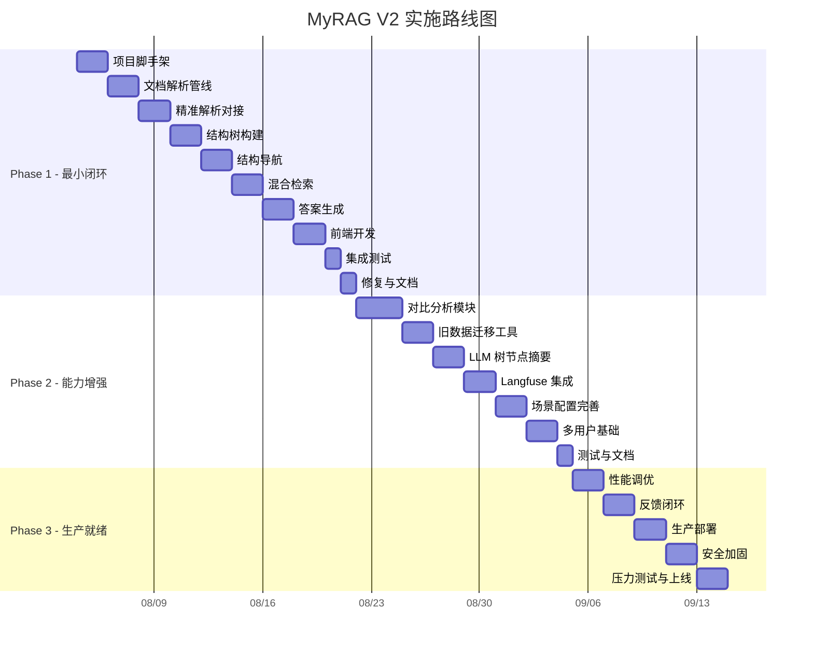

# MyRAG V2 — 新一代智能文档检索系统 需求设计文档

> **版本**：V2.0  
> **日期**：2026-07-28  
> **状态**：需求设计（Grill-Me 评审完成）  
> **项目类型**：全新项目  
> **参考文档**：  
> - 文档智能解析与检索一体化方案（V6 三层架构）  
> - PageIndex 与 Embedding 结合方案（五种集成模式）  
> - 投标文件 RAG 检索方案（引用机制设计）  
> - 投标文件比对分析方案（多维比对）

---

## 目录

1. [设计决策总表（Grill-Me 结论）](#1-设计决策总表)
2. [项目定位与目标](#2-项目定位与目标)
3. [总体架构](#3-总体架构)
4. [核心检索管线](#4-核心检索管线)
5. [数据模型设计](#5-数据模型设计)
6. [模块详细设计](#6-模块详细设计)
7. [API 接口设计](#7-api-接口设计)
8. [前端设计](#8-前端设计)
9. [非功能性需求](#9-非功能性需求)
10. [实施路线图](#10-实施路线图)
11. [风险与局限](#11-风险与局限)
12. [验收标准](#12-验收标准)
13. [附录](#13-附录)

---

## 1. 设计决策总表

> 以下 15 项决策通过 Grill-Me 逐一追问确认，构成本文档的架构基础。

| # | 决策点 | 结论 | 理由 |
|---|--------|------|------|
| 1 | 产品定位 | **双模式**：通用底座 + 投标文件场景插件 | 通用能力复用，场景特有功能按需加载 |
| 2 | 精细解析部署 | **独立微服务**（HTTP） | 与 MinerU 同模式，解耦重量级依赖 |
| 3 | 导航方式 | **Embedding 优先 + LLM 兜底** | 默认毫秒级，不确定时才调 LLM |
| 4 | 检索粒度 | **两级结构**：元素（存储/引用）+ 语义块（检索） | 兼顾引用精度和检索质量 |
| 5 | 数据表策略 | **单表增强**：语义块即 chunks 表 | 零迁移，一套检索逻辑 |
| 6 | 全文检索 | **pg_trgm + GIN 索引** | 零安装，Windows/Docker 一致 |
| 7 | 问题分类 | **取消分类器，统一路径** | 置信度即路由，零分支 |
| 8 | 引用机制 | **分级引用，按需加载** | 首次轻量快速，详情二次请求 |
| 9 | 树节点摘要 | **标题+截取为主，LLM 可选** | 默认零 LLM，入库秒级 |
| 10 | Rerank | **条件启用** | 分数胶着时才精排 |
| 11 | Phase 1 边界 | **全栈最小闭环** | 上传→树→提问→引用 |
| 12 | 场景插件实现 | **配置预设** | YAGNI，不搞插件框架 |
| 13 | 比对分析 | **Phase 2 独立模块** | 独立价值链，不阻塞核心 |
| 14 | LLM 模型 | **两级**：fast_model + generation_model | 成本降 60%，质量不降 |
| 15 | 旧数据过渡 | **只加树不重新解析** | 轻量升级，增量获得能力 |

---

## 2. 项目定位与目标

### 2.1 产品定位

**通用智能文档检索平台**，以投标文件场景为首个深度验证场景。

- **通用底座**：知识库管理、文档解析、向量检索、对话生成、Workflow、Agent
- **场景增强**（投标文件）：精细解析（元素坐标）、文档树导航、表格/图片引用、多文档比对

### 2.2 核心目标

| 目标 | 量化指标 |
|------|---------|
| 结构化文档检索准确率 | >= 95%（投标文件测试集） |
| 引用溯源精度 | 页码级 100%，元素级 >= 90% |
| 检索延迟 P95 | <= 2s（Embedding 导航路径），<= 5s（LLM 兜底路径） |
| 文档格式 | PDF（文本/扫描）、Word、Excel、Markdown |
| 表格/图片完整性 | 表格原生 HTML，图片独立存储 + OCR |
| 入库速度 | 100 页 PDF <= 60s（不含可选 LLM 摘要） |

### 2.3 核心痛点（解决）

1. 纯向量检索"相似 ≠ 相关" → **文档树导航缩小范围**
2. 引用不可追溯 → **三级引用（文档→页码→元素坐标）**
3. 表格/图片丢失 → **精细解析，元素级分离**
4. 无结构感知 → **自动构建文档树**
5. 检索延迟高 → **Embedding 导航（毫秒级）替代 LLM 逐层推理**

---

## 3. 总体架构

### 3.1 系统架构图

```
┌─────────────────────────────────────────────────────────────────────┐
│                          前端 (React + Vite)                         │
│  ┌──────────┐ ┌──────────┐ ┌──────────┐ ┌──────────┐ ┌──────────┐ │
│  │ 对话页面  │ │ 文档树   │ │ 知识库   │ │ 比对分析 │ │ Workflow │ │
│  │ +引用卡片│ │ 面板     │ │ 管理     │ │ (Ph2)   │ │ 编辑器   │ │
│  └──────────┘ └──────────┘ └──────────┘ └──────────┘ └──────────┘ │
└──────────────────────────────┬──────────────────────────────────────┘
                               │ REST API / WebSocket
┌──────────────────────────────┼──────────────────────────────────────┐
│                          后端 (FastAPI)                              │
│                              │                                       │
│  ┌───────────────────────────┼───────────────────────────────────┐  │
│  │                      API Layer                                 │  │
│  │  /conversations  /knowledge-bases  /documents  /retrieval     │  │
│  │  /analysis(Ph2)  /workflows  /agents                          │  │
│  └───────────────────────────┬───────────────────────────────────┘  │
│                              │                                       │
│  ┌───────────────────────────┼───────────────────────────────────┐  │
│  │                    Service Layer                               │  │
│  │  ┌─────────────┐ ┌─────────────┐ ┌─────────────────────────┐ │  │
│  │  │ Retrieval   │ │ Document    │ │ Conversation            │ │  │
│  │  │ Service     │ │ Service     │ │ Service                 │ │  │
│  │  └──────┬──────┘ └──────┬──────┘ └─────────────────────────┘ │  │
│  └─────────┼───────────────┼─────────────────────────────────────┘  │
│            │               │                                         │
│  ┌─────────┼───────────────┼─────────────────────────────────────┐  │
│  │         │          RAG Engine                                  │  │
│  │         ▼                                                      │  │
│  │  ┌─────────────────────────────────────────────────────────┐  │  │
│  │  │              Unified Retrieval Pipeline                  │  │  │
│  │  │                                                         │  │  │
│  │  │  Query ──→ Embedding Nav ──→ Scoped Search ──→ RRF     │  │  │
│  │  │              │                    │                │      │  │  │
│  │  │              │ confidence < T     │                │      │  │  │
│  │  │              ▼                    ▼                ▼      │  │  │
│  │  │         LLM Fallback        Vector+pg_trgm   Rerank    │  │  │
│  │  │         (rare)              + Elements       (cond.)    │  │  │
│  │  └─────────────────────────────────────────────────────────┘  │  │
│  │                                                                │  │
│  │  ┌──────────┐ ┌──────────┐ ┌──────────┐ ┌──────────────────┐ │  │
│  │  │ Tree     │ │ Nav      │ │ Embedding│ │ Rerank           │ │  │
│  │  │ Module   │ │ Module   │ │ Module   │ │ Module           │ │  │
│  │  └──────────┘ └──────────┘ └──────────┘ └──────────────────┘ │  │
│  └────────────────────────────────────────────────────────────────┘  │
│                                                                      │
│  ┌────────────────────────────────────────────────────────────────┐  │
│  │                    Task Queue (ARQ + Redis)                     │  │
│  │  parse_document  build_tree  generate_embeddings  gen_summaries│  │
│  └────────────────────────────────────────────────────────────────┘  │
└──────────────────────────────────────────────────────────────────────┘
         │                    │                      │
         ▼                    ▼                      ▼
┌─────────────────┐ ┌─────────────────┐  ┌─────────────────────────┐
│  PostgreSQL 15  │ │     Redis       │  │  Precision Parser       │
│  + PGVector     │ │  (cache/queue)  │  │  Microservice           │
│  + pg_trgm      │ │                 │  │  (pdfplumber/PaddleOCR) │
└─────────────────┘ └─────────────────┘  └─────────────────────────┘
         │
         ▼
┌─────────────────┐
│     MinIO       │
│  (file store)   │
└─────────────────┘
```

### 3.2 技术栈

| 层级 | 选型 | 说明 |
|------|------|------|
| 后端 | Python 3.11 + FastAPI + SQLAlchemy (async) | |
| 数据库 | PostgreSQL 15 + pgvector + pg_trgm | 向量+全文+关系一体 |
| 缓存/队列 | Redis 7 | 导航缓存 + ARQ 任务队列 |
| 文件存储 | MinIO | 原文件 + 解析产物 + 图片 |
| 精细解析 | 独立微服务 (FastAPI) | pdfplumber + pypdf + PaddleOCR(可选) |
| Embedding | bge-large-zh / text-embedding-3-small | 可配置 |
| LLM (fast) | gpt-4o-mini / Qwen2.5-7B | 导航兜底、摘要生成 |
| LLM (generation) | GPT-4o / DeepSeek-V3 | 最终回答生成 |
| Rerank | bge-reranker-v2-m3 | 条件启用 |
| 前端 | React 18 + TypeScript + Vite + Ant Design | |
| 部署 | Docker Compose | 开发/生产一致 |

---

## 4. 核心检索管线

### 4.1 统一检索路径（无分支）

> 决策 #7：取消问题分类器，所有查询走同一条管线。置信度即路由。

```
用户问题
    │
    ▼
┌─────────────────────────────────────────────────────┐
│ Step 1: Embedding 导航（毫秒级）                     │
│                                                     │
│  query_embedding = embed(question)                  │
│  candidates = cosine_sim(query_emb, node_embeddings)│
│                                                     │
│  if top1.score - top2.score > margin:               │
│      → 高置信度：限定到该节点的 page_range          │
│      → scope = {doc_id, page_start, page_end}      │
│  else:                                              │
│      → 低置信度：进入 LLM 兜底（Step 1b）          │
│      → 或全量搜索（scope = null）                   │
└───────────────────────┬─────────────────────────────┘
                        │
          ┌─────────────┼─────────────┐
          │ (低置信度)   │             │ (高置信度)
          ▼             │             ▼
┌──────────────────┐    │    ┌──────────────────────┐
│ Step 1b: LLM    │    │    │ Step 2: 范围内检索    │
│ 兜底裁决        │    │    │                      │
│ (偶尔, ~15%)   │    │    │  向量检索 (PGVector) │
│                 │    │    │  + pg_trgm 关键词    │
│ 从 top-3 节点  │    │    │  (限定 page_range)   │
│ 中选一个       │    │    │                      │
│ 或选"全量"     │    │    │  各取 top_k * 2      │
└────────┬────────┘    │    └──────────┬───────────┘
         │             │               │
         └─────────────┼───────────────┘
                       ▼
┌─────────────────────────────────────────────────────┐
│ Step 3: RRF 融合                                    │
│                                                     │
│  rrf_score(d) = w_vec/(k+rank_vec)                  │
│               + w_kw/(k+rank_kw)                    │
│                                                     │
│  默认: w_vec=0.7, w_kw=0.3, k=60                   │
└───────────────────────┬─────────────────────────────┘
                        ▼
┌─────────────────────────────────────────────────────┐
│ Step 4: 条件 Rerank                                 │
│                                                     │
│  if top1.rrf - top2.rrf < rerank_threshold:         │
│      → 调用 Rerank 模型精排 top-N                   │
│  else:                                              │
│      → 直接返回（RRF 已排好）                       │
└───────────────────────┬─────────────────────────────┘
                        ▼
┌─────────────────────────────────────────────────────┐
│ Step 5: 组装轻量引用                                │
│                                                     │
│  每个结果:                                          │
│  {                                                  │
│    content, score, page_number,                     │
│    document_filename, section_path,                 │
│    element_count                                    │
│  }                                                  │
│                                                     │
│  前端按需加载: GET /elements?chunk_id=xxx           │
└───────────────────────┬─────────────────────────────┘
                        ▼
┌─────────────────────────────────────────────────────┐
│ Step 6: LLM 生成回答                                │
│                                                     │
│  Prompt = system + references + question            │
│  Model = generation_model                           │
│  Output = 带 [1][2] 引用的结构化回答                │
└─────────────────────────────────────────────────────┘
```

### 4.2 性能预期

| 路径 | 触发条件 | 延迟 | LLM 调用 |
|------|---------|------|---------|
| 快路径 | Embedding 导航高置信度 + RRF 分数分明 | **< 1s** | 仅生成回答 1 次 |
| 中路径 | Embedding 导航高置信度 + Rerank 触发 | **< 2s** | 仅生成回答 1 次 |
| 慢路径 | LLM 兜底裁决 + Rerank | **< 5s** | 导航裁决 1 次 + 生成 1 次 |
| 兜底路径 | 无树/导航完全失败 | **< 1s** | 仅生成回答 1 次 |

---

## 5. 数据模型设计

### 5.1 ER 关系图

```mermaid
erDiagram
    users ||--o{ knowledge_bases : owns
    knowledge_bases ||--o{ documents : contains
    documents ||--o{ chunks : "split into"
    documents ||--o{ doc_tree_nodes : "has tree"
    documents ||--o{ element_positions : "has elements"
    doc_tree_nodes ||--o{ doc_tree_nodes : "parent-child"
    chunks ||--o{ element_positions : "contains"
    knowledge_bases ||--o{ conversations : "used in"
    conversations ||--o{ messages : contains

    users {
        uuid id PK
        string email
        string hashed_password
        string role
    }

    knowledge_bases {
        uuid id PK
        uuid user_id FK
        string name
        string description
        string scene_preset
        string embedding_model
        int vector_dimension
        string chunk_strategy
        int chunk_size
        int chunk_overlap
        string retrieval_method
        int retrieval_top_k
        float similarity_threshold
        float vector_weight
        float keyword_weight
        bool navigation_enabled
        float nav_confidence_threshold
        int nav_max_depth
        bool rerank_enabled
        string rerank_model
        int rerank_top_n
        float rerank_threshold
        string fast_model
        string generation_model
        bool generate_summaries
        string parse_precision
        int document_count
        int chunk_count
        timestamp created_at
    }

    documents {
        uuid id PK
        uuid knowledge_base_id FK
        uuid user_id FK
        string filename
        string file_path
        string file_type
        int file_size
        string status
        string parse_precision
        bool is_scanned
        bool has_bookmarks
        int page_count
        int chunk_count
        int element_count
        int tree_node_count
        jsonb doc_tree
        jsonb doc_metadata
        timestamp created_at
    }

    chunks {
        uuid id PK
        uuid document_id FK
        uuid knowledge_base_id FK
        string clause_id
        string clause_type
        string clause_title
        string section_path
        int section_level
        text content
        text content_for_search
        int page_number
        int page_start
        int page_end
        vector embedding_vector
        string embedding_model
        jsonb chunk_metadata
        int content_length
        int element_count
        timestamp created_at
    }

    doc_tree_nodes {
        uuid id PK
        uuid document_id FK
        uuid parent_id FK
        uuid root_id
        int level
        int sort_order
        string title
        text summary
        text content_preview
        int page_start
        int page_end
        int element_count
        int child_count
        vector nav_embedding
        timestamp created_at
    }

    element_positions {
        uuid id PK
        uuid document_id FK
        uuid chunk_id FK
        uuid tree_node_id FK
        string element_type
        int element_index
        int page_number
        float pos_x0
        float pos_y0
        float pos_x1
        float pos_y1
        text content
        text table_html
        text ocr_text
        string image_path
        int image_width
        int image_height
        jsonb metadata
        timestamp created_at
    }

    conversations {
        uuid id PK
        uuid user_id FK
        uuid knowledge_base_id FK
        string title
        jsonb config
        timestamp created_at
    }

    messages {
        uuid id PK
        uuid conversation_id FK
        string role
        text content
        jsonb references
        jsonb nav_path
        string retrieval_mode
        float nav_confidence
        int latency_ms
        timestamp created_at
    }
```



### 5.2 DDL

```sql
-- 启用扩展
CREATE EXTENSION IF NOT EXISTS vector;
CREATE EXTENSION IF NOT EXISTS pg_trgm;
CREATE EXTENSION IF NOT EXISTS "uuid-ossp";

-- 用户表
CREATE TABLE users (
    id UUID PRIMARY KEY DEFAULT uuid_generate_v4(),
    email VARCHAR(255) UNIQUE NOT NULL,
    hashed_password VARCHAR(255) NOT NULL,
    display_name VARCHAR(100),
    role VARCHAR(20) DEFAULT 'user',
    is_active BOOLEAN DEFAULT true,
    created_at TIMESTAMP DEFAULT NOW()
);

-- 知识库表
CREATE TABLE knowledge_bases (
    id UUID PRIMARY KEY DEFAULT uuid_generate_v4(),
    user_id UUID NOT NULL REFERENCES users(id) ON DELETE CASCADE,

    -- 基本信息
    name VARCHAR(100) NOT NULL,
    description TEXT,
    scene_preset VARCHAR(20) DEFAULT 'general',  -- general / bid_document

    -- Embedding 配置
    embedding_model VARCHAR(64) DEFAULT 'text-embedding-3-small',
    vector_dimension INTEGER DEFAULT 1536,

    -- 分块配置
    chunk_strategy VARCHAR(20) DEFAULT 'auto',
    chunk_size INTEGER DEFAULT 800,
    chunk_overlap INTEGER DEFAULT 100,

    -- 检索配置
    retrieval_method VARCHAR(20) DEFAULT 'hybrid',  -- hybrid / vector / keyword
    retrieval_top_k INTEGER DEFAULT 10,
    similarity_threshold FLOAT DEFAULT 0.3,
    vector_weight FLOAT DEFAULT 0.7,
    keyword_weight FLOAT DEFAULT 0.3,

    -- 导航配置
    navigation_enabled BOOLEAN DEFAULT true,
    nav_confidence_threshold FLOAT DEFAULT 0.15,  -- top1-top2 margin
    nav_max_depth INTEGER DEFAULT 10,

    -- Rerank 配置
    rerank_enabled BOOLEAN DEFAULT true,
    rerank_model VARCHAR(64) DEFAULT 'bge-reranker-v2-m3',
    rerank_top_n INTEGER DEFAULT 10,
    rerank_threshold FLOAT DEFAULT 0.02,  -- RRF 分数差 < 此值时触发

    -- LLM 模型（两级）
    fast_model VARCHAR(64) DEFAULT 'gpt-4o-mini',
    generation_model VARCHAR(64) DEFAULT 'gpt-4o',

    -- 解析配置
    parse_precision VARCHAR(20) DEFAULT 'standard',  -- standard / precision
    generate_summaries BOOLEAN DEFAULT false,

    -- 统计
    document_count INTEGER DEFAULT 0,
    chunk_count INTEGER DEFAULT 0,

    created_at TIMESTAMP DEFAULT NOW(),
    updated_at TIMESTAMP DEFAULT NOW()
);

-- 文档表
CREATE TABLE documents (
    id UUID PRIMARY KEY DEFAULT uuid_generate_v4(),
    knowledge_base_id UUID NOT NULL REFERENCES knowledge_bases(id) ON DELETE CASCADE,
    user_id UUID NOT NULL REFERENCES users(id),

    -- 文件信息
    filename VARCHAR(255) NOT NULL,
    file_path VARCHAR(512) NOT NULL,
    file_type VARCHAR(20) NOT NULL,
    file_size INTEGER NOT NULL,

    -- 处理状态
    status VARCHAR(20) DEFAULT 'pending',
    processing_progress INTEGER DEFAULT 0,
    processing_message VARCHAR(255),
    error_message TEXT,

    -- 解析配置
    parse_precision VARCHAR(20) DEFAULT 'standard',
    is_scanned BOOLEAN DEFAULT false,
    has_bookmarks BOOLEAN DEFAULT false,
    page_count INTEGER DEFAULT 0,

    -- 统计
    chunk_count INTEGER DEFAULT 0,
    element_count INTEGER DEFAULT 0,
    tree_node_count INTEGER DEFAULT 0,

    -- 文档树（完整 JSON，前端渲染用）
    doc_tree JSONB,

    -- 元数据
    doc_metadata JSONB,

    created_at TIMESTAMP DEFAULT NOW(),
    updated_at TIMESTAMP DEFAULT NOW(),
    processed_at TIMESTAMP
);
CREATE INDEX idx_documents_kb ON documents(knowledge_base_id);
CREATE INDEX idx_documents_status ON documents(status);

-- 语义块表（检索单位）
CREATE TABLE chunks (
    id UUID PRIMARY KEY DEFAULT uuid_generate_v4(),
    document_id UUID NOT NULL REFERENCES documents(id) ON DELETE CASCADE,
    knowledge_base_id UUID NOT NULL REFERENCES knowledge_bases(id),

    -- 结构信息
    clause_id VARCHAR(64),
    clause_type VARCHAR(32),
    clause_title VARCHAR(255),
    section_path TEXT,          -- "技术部分 > 叉车参数 > 3.5吨电动"
    section_level INTEGER DEFAULT 1,

    -- 内容
    content TEXT NOT NULL,              -- 原文（用于引用展示）
    content_for_search TEXT,            -- 检索用文本（可拼入 OCR）

    -- 页码
    page_number INTEGER DEFAULT 1,
    page_start INTEGER DEFAULT 1,
    page_end INTEGER DEFAULT 1,

    -- 向量
    embedding_vector vector(1536),
    embedding_model VARCHAR(64),

    -- 元数据
    chunk_metadata JSONB DEFAULT '{}',
    content_length INTEGER DEFAULT 0,
    element_count INTEGER DEFAULT 0,

    created_at TIMESTAMP DEFAULT NOW()
);
CREATE INDEX idx_chunks_doc ON chunks(document_id);
CREATE INDEX idx_chunks_kb ON chunks(knowledge_base_id);
CREATE INDEX idx_chunks_page ON chunks(document_id, page_number);
CREATE INDEX idx_chunks_embedding ON chunks USING ivfflat (embedding_vector vector_cosine_ops) WITH (lists = 100);
-- pg_trgm 索引（全文检索）
CREATE INDEX idx_chunks_content_trgm ON chunks USING gin (content_for_search gin_trgm_ops);

-- 文档树节点表
CREATE TABLE doc_tree_nodes (
    id UUID PRIMARY KEY DEFAULT uuid_generate_v4(),
    document_id UUID NOT NULL REFERENCES documents(id) ON DELETE CASCADE,
    parent_id UUID REFERENCES doc_tree_nodes(id) ON DELETE CASCADE,
    root_id UUID NOT NULL,

    -- 树结构
    level INTEGER NOT NULL DEFAULT 0,
    sort_order INTEGER NOT NULL DEFAULT 0,

    -- 内容
    title VARCHAR(500) NOT NULL,
    summary TEXT,               -- LLM 摘要（可选）或截取内容
    content_preview TEXT,       -- 前 200 字

    -- 页码范围
    page_start INTEGER NOT NULL,
    page_end INTEGER NOT NULL,

    -- 统计
    element_count INTEGER DEFAULT 0,
    child_count INTEGER DEFAULT 0,

    -- 导航向量
    nav_embedding vector(1536),

    created_at TIMESTAMP DEFAULT NOW()
);
CREATE INDEX idx_tree_doc ON doc_tree_nodes(document_id);
CREATE INDEX idx_tree_parent ON doc_tree_nodes(parent_id);
CREATE INDEX idx_tree_root ON doc_tree_nodes(root_id);
CREATE INDEX idx_tree_page ON doc_tree_nodes(document_id, page_start, page_end);
CREATE INDEX idx_tree_nav_emb ON doc_tree_nodes USING ivfflat (nav_embedding vector_cosine_ops) WITH (lists = 50);

-- 元素位置表（引用单位）
CREATE TABLE element_positions (
    id UUID PRIMARY KEY DEFAULT uuid_generate_v4(),
    document_id UUID NOT NULL REFERENCES documents(id) ON DELETE CASCADE,
    chunk_id UUID REFERENCES chunks(id) ON DELETE SET NULL,
    tree_node_id UUID REFERENCES doc_tree_nodes(id) ON DELETE SET NULL,

    -- 元素信息
    element_type VARCHAR(20) NOT NULL,  -- text / table / image / formula
    element_index INTEGER NOT NULL,

    -- 位置
    page_number INTEGER NOT NULL,
    pos_x0 FLOAT,
    pos_y0 FLOAT,
    pos_x1 FLOAT,
    pos_y1 FLOAT,

    -- 内容
    content TEXT,
    table_html TEXT,            -- 表格原生 HTML
    ocr_text TEXT,              -- 图片 OCR 结果

    -- 图片
    image_path VARCHAR(512),
    image_width INTEGER,
    image_height INTEGER,

    -- 元数据
    metadata JSONB DEFAULT '{}',

    created_at TIMESTAMP DEFAULT NOW()
);
CREATE INDEX idx_elem_doc_page ON element_positions(document_id, page_number);
CREATE INDEX idx_elem_chunk ON element_positions(chunk_id);
CREATE INDEX idx_elem_type ON element_positions(element_type);

-- 对话表
CREATE TABLE conversations (
    id UUID PRIMARY KEY DEFAULT uuid_generate_v4(),
    user_id UUID NOT NULL REFERENCES users(id) ON DELETE CASCADE,
    knowledge_base_id UUID REFERENCES knowledge_bases(id),
    title VARCHAR(255),
    config JSONB DEFAULT '{}',
    created_at TIMESTAMP DEFAULT NOW(),
    updated_at TIMESTAMP DEFAULT NOW()
);

-- 消息表
CREATE TABLE messages (
    id UUID PRIMARY KEY DEFAULT uuid_generate_v4(),
    conversation_id UUID NOT NULL REFERENCES conversations(id) ON DELETE CASCADE,
    role VARCHAR(20) NOT NULL,  -- user / assistant / system
    content TEXT NOT NULL,

    -- 检索元数据（assistant 消息）
    "references" JSONB,         -- 引用列表
    nav_path JSONB,             -- 导航路径 ["技术部分", "叉车参数"]
    retrieval_mode VARCHAR(20), -- fast / llm_fallback / full_scan
    nav_confidence FLOAT,
    latency_ms INTEGER,

    created_at TIMESTAMP DEFAULT NOW()
);
CREATE INDEX idx_messages_conv ON messages(conversation_id);
```

### 5.3 场景预设配置

> 决策 #12：场景 = 配置预设，不是插件框架。

```python
SCENE_PRESETS = {
    "general": {
        "parse_precision": "standard",
        "navigation_enabled": True,
        "nav_confidence_threshold": 0.15,
        "rerank_enabled": True,
        "rerank_threshold": 0.02,
        "generate_summaries": False,
        "chunk_strategy": "auto",
        "chunk_size": 800,
    },
    "bid_document": {
        "parse_precision": "precision",
        "navigation_enabled": True,
        "nav_confidence_threshold": 0.12,  # 更激进地限定范围
        "rerank_enabled": True,
        "rerank_threshold": 0.03,
        "generate_summaries": True,  # 标书章节标题可能模糊
        "chunk_strategy": "structured",
        "chunk_size": 1200,
    },
}
```


---

## 6. 模块详细设计

### 6.1 项目目录结构

`
myrag-v2/
├── backend/
│   ├── app/
│   │   ├── main.py                 # FastAPI 入口
│   │   ├── config.py               # 配置管理（Pydantic Settings）
│   │   ├── database.py             # SQLAlchemy async engine
│   │   ├── models/                 # ORM 模型
│   │   │   ├── document.py
│   │   │   ├── element.py
│   │   │   ├── tree_node.py
│   │   │   └── conversation.py
│   │   ├── schemas/                # Pydantic 请求/响应模型
│   │   ├── api/                    # 路由
│   │   │   ├── documents.py
│   │   │   ├── chat.py
│   │   │   ├── elements.py
│   │   │   └── auth.py
│   │   ├── services/               # 业务逻辑
│   │   │   ├── parser/             # 解析模块
│   │   │   │   ├── fast_parser.py
│   │   │   │   └── precision_client.py
│   │   │   ├── tree/               # 结构树
│   │   │   │   └── tree_builder.py
│   │   │   ├── navigator/          # 结构导航
│   │   │   │   └── navigator.py
│   │   │   ├── pipeline/           # 检索管线
│   │   │   │   ├── vector_search.py
│   │   │   │   ├── fulltext_search.py
│   │   │   │   ├── rrf_merge.py
│   │   │   │   └── reranker.py
│   │   │   ├── generator/          # 答案生成
│   │   │   │   └── llm_generator.py
│   │   │   └── scenes/             # 场景预设
│   │   │       └── presets.py
│   │   ├── worker/                 # Celery 异步任务
│   │   │   └── tasks.py
│   │   └── utils/
│   ├── alembic/                    # 数据库迁移
│   ├── tests/
│   ├── Dockerfile
│   └── pyproject.toml
├── precision-parser/               # 精准解析微服务（独立部署）
│   ├── app.py
│   ├── Dockerfile
│   └── requirements.txt
├── frontend/
│   ├── src/
│   │   ├── pages/
│   │   ├── components/
│   │   ├── stores/
│   │   ├── hooks/
│   │   └── api/
│   ├── Dockerfile
│   └── package.json
├── config/
│   └── scenes.yaml
├── deploy/
│   ├── nginx.conf
│   └── docker-compose.yml
├── docs/
└── .env.example
`

### 6.2 精准解析微服务 (precision-parser)

独立部署的 HTTP 服务，封装 MinerU，与主后端解耦。

**接口定义：**

```python
# precision-parser/app/main.py
from fastapi import FastAPI, BackgroundTasks
from pydantic import BaseModel

app = FastAPI(title="Precision Parser Service")

class ParseRequest(BaseModel):
    file_url: str              # MinIO 预签名 URL 或文件路径
    doc_id: str
    backend_callback_url: str  # 解析完成后回调主后端

class ParseResponse(BaseModel):
    task_id: str
    status: str  # "accepted"

@app.post("/api/v1/parse", response_model=ParseResponse)
async def start_parse(req: ParseRequest):
    """
    接收解析请求，异步执行 MinerU 解析。
    完成后回调主后端: POST {callback_url}/internal/parse-complete
    回调 payload: {
        "doc_id": "...",
        "status": "completed" | "failed",
        "content_md": "...(完整 Markdown)",
        "elements": [...(结构化元素列表)],
        "page_count": 120,
        "error": null
    }
    """
    ...

@app.get("/health")
async def health():
    return {"status": "ok", "gpu_available": True}
```

**主后端回调处理：**

```python
# backend/app/api/internal.py
@router.post("/internal/parse-complete")
async def parse_complete(payload: ParseCompletePayload):
    # 1. 保存 content_md 到 MinIO
    # 2. 批量写入 doc_elements
    # 3. 触发树构建任务 (enqueue build_tree)
    # 4. 更新文档状态为 tree_building
```

### 6.3 树构建器 (tree_service)

```python
# backend/app/services/tree_service.py
class TreeBuilder:
    """从 Markdown 标题构建章节树，生成 doc_tree_nodes"""

    async def build_tree(self, doc_id: int, content_md: str) -> None:
        # 1. 解析 Markdown 标题行
        headings = self._extract_headings(content_md)
        # 正则: ^(#{1,6})\s+(.+)$ 配合行号记录

        # 2. 构建层级 (栈算法)
        nodes = self._build_hierarchy(headings)

        # 3. 计算页码范围 (从元素 page_idx 映射)
        await self._assign_page_ranges(doc_id, nodes)

        # 4. 生成节点摘要 (标题+首段，不调 LLM)
        for node in nodes:
            node.summary = self._title_excerpt_summary(node)

        # 5. 批量写入 doc_tree_nodes
        await self._bulk_insert(doc_id, nodes)

        # 6. 触发向量化 (enqueue embed_tree_nodes)

    def _title_excerpt_summary(self, node) -> str:
        """默认摘要策略: 标题 + 首段前200字"""
        excerpt = node.first_paragraph[:200] if node.first_paragraph else ""
        return f"{node.title}。{excerpt}" if excerpt else node.title
```

### 6.4 Embedding 导航器 (navigator)

```python
# backend/app/core/navigator.py
class EmbeddingNavigator:
    """
    用 query 向量与 doc_tree_nodes.embedding 做余弦相似度，
    返回 top-K 相关章节节点，实现毫秒级范围定位。
    """

    def __init__(self, scene_config):
        self.top_k = scene_config.nav_top_k          # 默认 5
        self.threshold = scene_config.nav_threshold   # 默认 0.30
        self.max_depth = scene_config.nav_max_depth   # 默认 2

    async def navigate(self, query_embedding: list, doc_ids: list):
        # 1. 查询 doc_tree_nodes 中 embedding 最相似的节点
        #    WHERE doc_id IN (...) AND depth <= max_depth
        #    ORDER BY embedding <=> query_embedding
        #    LIMIT top_k

        # 2. 过滤低于阈值的结果
        # 3. 展开每个命中节点的后代 ID 集合
        # 4. 返回 NavigationResult

        return NavigationResult(
            hit_nodes=[],            # 命中的树节点
            scope_node_ids=[],       # 展开后的节点 ID 集合
            scope_element_ids=[],    # 对应的元素 ID 范围
            nav_confidence=0.82,     # 最高相似度分数
            scoped=True,             # 是否成功缩域
        )

    async def navigate_global(self, query_embedding: list):
        """无文档范围时，全局导航定位相关文档+章节"""
        # 不限制 doc_ids，全局搜索树节点
        # 返回结果包含 doc_id 信息
        ...
```

### 6.5 统一检索管线 (pipeline)

```python
# backend/app/core/pipeline.py
class RetrievalPipeline:
    """
    统一检索管线 - 所有查询走同一条路径。
    没有分类器，没有分支，置信度即路由。
    """

    def __init__(self, scene: str = "general"):
        self.config = get_scene_config(scene)
        self.navigator = EmbeddingNavigator(self.config)
        self.searcher = HybridSearcher(self.config)
        self.ranker = RRFRanker(self.config)
        self.generator = AnswerGenerator()
        self.ref_builder = ReferenceBuilder()

    async def execute(self, query: str, conversation_id: int,
                      doc_ids: list = None):

        # Step 1: Query 向量化
        query_embedding = await embed_service.embed_query(query)

        # Step 2: Embedding 导航 (毫秒级)
        if doc_ids:
            nav = await self.navigator.navigate(query_embedding, doc_ids)
        else:
            nav = await self.navigator.navigate_global(query_embedding)

        # Step 3: 混合搜索 (导航缩域后)
        search_scope = nav.scope_element_ids if nav.scoped else None
        vector_hits, trgm_hits = await self.searcher.search(
            query=query,
            query_embedding=query_embedding,
            doc_ids=doc_ids,
            element_id_scope=search_scope,
        )

        # Step 4: RRF 融合
        fused = self.ranker.rrf_fuse(vector_hits, trgm_hits)

        # Step 5: 条件 Rerank
        if self.ranker.should_rerank(fused):
            fused = await self.ranker.rerank(query, fused)

        # Step 6: 取 Top-N chunks
        top_chunks = fused[:self.config.top_n]

        # Step 7: 构建轻量引用
        references = self.ref_builder.build_light(top_chunks)

        # Step 8: LLM 生成答案 (流式)
        answer_stream = self.generator.generate_stream(
            query=query,
            chunks=top_chunks,
            references=references,
            nav_context=nav,
        )

        return PipelineResult(
            answer_stream=answer_stream,
            references=references,
            nav_info=nav,
            search_stats={
                "vector_count": len(vector_hits),
                "trgm_count": len(trgm_hits),
                "fused_count": len(fused),
                "reranked": self.ranker.last_reranked,
                "nav_scoped": nav.scoped,
            },
        )
```

### 6.6 答案生成器 (generator)

```python
# backend/app/core/generator.py
class AnswerGenerator:
    """使用 generation_model 生成答案，流式输出"""

    SYSTEM_PROMPT = """你是一个专业的文档问答助手。根据提供的参考资料回答用户问题。

规则：
1. 仅基于提供的参考资料回答，不要编造信息
2. 使用 [n] 标注引用来源，n 为引用编号
3. 如果参考资料不足以回答，明确告知用户
4. 保持回答结构清晰，必要时使用列表或表格
5. 回答语言与用户提问语言一致

参考资料：
{context}
"""

    async def generate_stream(self, query: str, chunks: list,
                              references: list, nav_context=None):
        context = self._format_context(chunks, references)
        messages = [
            {"role": "system", "content": self.SYSTEM_PROMPT.format(context=context)},
            {"role": "user", "content": query},
        ]
        async for token in llm_client.stream_chat(
            model=settings.generation_model,
            messages=messages,
            temperature=0.1,
        ):
            yield token
```

### 6.7 场景预设配置 (scenes)

```python
# backend/app/core/scenes.py
from dataclasses import dataclass

@dataclass
class SceneConfig:
    name: str
    # 导航参数
    nav_top_k: int = 5
    nav_threshold: float = 0.30
    nav_max_depth: int = 2
    # 搜索参数
    vector_top_k: int = 20
    trgm_top_k: int = 20
    trgm_weight: float = 0.3
    vector_weight: float = 0.7
    # RRF 参数
    rrf_k: int = 60
    # Rerank 参数
    rerank_enabled: bool = True
    rerank_threshold: float = 0.05
    rerank_top_n: int = 10
    # 输出参数
    top_n: int = 8
    max_context_tokens: int = 6000
    # 解析参数
    default_parser: str = "basic"
    # 树参数
    tree_summary_mode: str = "title_excerpt"

SCENE_PRESETS = {
    "general": SceneConfig(
        name="通用文档",
        default_parser="basic",
        vector_top_k=20,
        trgm_top_k=15,
    ),
    "bid_document": SceneConfig(
        name="投标文件",
        default_parser="precision",
        nav_top_k=8,
        nav_threshold=0.25,
        vector_top_k=30,
        trgm_top_k=30,
        trgm_weight=0.4,
        vector_weight=0.6,
        top_n=12,
        max_context_tokens=8000,
        rerank_threshold=0.03,
    ),
}

def get_scene_config(scene: str) -> SceneConfig:
    return SCENE_PRESETS.get(scene, SCENE_PRESETS["general"])
```


---

## 7. API 接口设计

> 基础路径: `/api/v2`。所有接口返回统一格式 `{ code, message, data }`（流式接口除外）。

### 7.1 接口总览

| # | 方法 | 路径 | 说明 | 认证 |
|---|------|------|------|------|
| 1 | POST | /documents/upload | 上传文档（快速/精准） | ✅ |
| 2 | GET | /documents | 文档列表（分页） | ✅ |
| 3 | GET | /documents/{id} | 文档详情 | ✅ |
| 4 | DELETE | /documents/{id} | 删除文档（级联） | ✅ |
| 5 | GET | /documents/{id}/tree | 文档结构树 | ✅ |
| 6 | GET | /documents/{id}/elements | 元素列表（分页/按类型） | ✅ |
| 7 | POST | /documents/{id}/summarize-tree | 触发 LLM 树节点摘要 | ✅ |
| 8 | POST | /chat | 对话（SSE 流式） | ✅ |
| 9 | GET | /chat/conversations | 会话列表 | ✅ |
| 10 | POST | /chat/conversations | 创建会话 | ✅ |
| 11 | GET | /chat/conversations/{id}/messages | 会话消息历史 | ✅ |
| 12 | DELETE | /chat/conversations/{id} | 删除会话 | ✅ |
| 13 | GET | /elements/{id} | 元素详情（引用懒加载） | ✅ |
| 14 | GET | /elements/{id}/context | 元素上下文（前后兄弟） | ✅ |
| 15 | POST | /navigate | 结构导航（调试用） | ✅ |
| 16 | POST | /search | 混合检索（调试用） | ✅ |
| 17 | GET | /scenes | 可用场景列表 | ✅ |
| 18 | POST | /feedback | 答案反馈（👍/👎） | ✅ |
| 19 | GET | /health | 健康检查 | ❌ |
| 20 | POST | /auth/login | 登录获取 JWT | ❌ |
| 21 | POST | /auth/refresh | 刷新 Token | ✅ |
| 22 | GET | /parse-tasks/{id} | 解析任务状态 | ✅ |

### 7.2 核心接口详细定义

#### 7.2.1 POST /documents/upload

上传文档并触发解析。

**Request**: `multipart/form-data`

| 字段 | 类型 | 必填 | 说明 |
|------|------|------|------|
| files | File[] | ✅ | 支持多文件，单文件 ≤100MB |
| parse_mode | string | ❌ | `fast`(默认) / `precision` |
| scene | string | ❌ | 场景预设 ID（默认 `general`） |
| language | string | ❌ | `auto`(默认) / `zh` / `en` |

**Response** (202 Accepted):

```json
{
  "code": 0,
  "data": {
    "tasks": [
      {
        "task_id": "task_abc123",
        "document_id": "doc_001",
        "filename": "技术规范书.pdf",
        "parse_mode": "precision",
        "status": "pending"
      }
    ]
  }
}
```

**错误码**:

| code | 说明 |
|------|------|
| 40001 | 不支持的文件格式 |
| 40002 | 文件超过大小限制 |
| 40003 | 精准解析服务不可用（降级提示） |

---

#### 7.2.2 GET /documents/{id}/tree

返回文档完整结构树。

**Response**:

```json
{
  "code": 0,
  "data": {
    "document_id": "doc_001",
    "title": "技术规范书",
    "tree": [
      {
        "node_id": "node_001",
        "title": "第一章 总则",
        "level": 1,
        "summary": null,
        "element_count": 5,
        "children": [
          {
            "node_id": "node_002",
            "title": "1.1 项目概述",
            "level": 2,
            "summary": null,
            "element_count": 12,
            "children": []
          }
        ]
      }
    ]
  }
}
```

---

#### 7.2.3 POST /chat （核心对话接口，SSE 流式）

**Request**:

```json
{
  "question": "项目验收需要满足哪些条件？",
  "conversation_id": "conv_001",
  "document_ids": ["doc_001", "doc_002"],
  "scene": "general",
  "top_k": 5
}
```

| 字段 | 类型 | 必填 | 说明 |
|------|------|------|------|
| question | string | ✅ | 用户问题 |
| conversation_id | string | ❌ | 空则自动创建新会话 |
| document_ids | string[] | ✅ | 至少选择一个文档 |
| scene | string | ❌ | 场景预设（默认 general） |
| top_k | int | ❌ | 检索条数（默认 5，最大 20） |

**Response**: SSE 流（`Content-Type: text/event-stream`）

事件类型与顺序:

```
event: phase
data: {"phase": "parse", "message": "正在分析问题..."}

event: phase
data: {"phase": "navigate", "message": "正在定位文档结构..."}

event: navigation
data: {"anchors": [{"node_id": "node_005", "title": "4.2 验收标准", "confidence": 0.91}], "fallback_used": false}

event: phase
data: {"phase": "retrieve", "message": "正在检索相关内容..."}

event: references
data: {"references": [{"ref_id": "r1", "element_id": "elem_123", "doc_title": "技术规范书", "node_title": "4.2 验收标准", "content_preview": "项目验收应满足以下条件...", "score": 0.87, "type": "text"}]}

event: phase
data: {"phase": "generate", "message": "正在生成回答..."}

event: token
data: {"token": "根据"}

event: token
data: {"token": "技术规范书"}

event: token
data: {"token": "第4.2节"}

event: done
data: {"message_id": "msg_001", "conversation_id": "conv_001", "usage": {"prompt_tokens": 3200, "completion_tokens": 450}, "latency_ms": 2800}

event: trace
data: {"trace_id": "trace_xyz", "nav_ms": 45, "retrieve_ms": 120, "generate_ms": 2600, "total_ms": 2800}
```

**错误事件**:

```
event: error
data: {"code": 50001, "message": "LLM 服务超时，请重试"}
```

---

#### 7.2.4 GET /elements/{id} （引用懒加载）

前端点击引用卡片时调用，返回元素完整内容。

**Response**:

```json
{
  "code": 0,
  "data": {
    "element_id": "elem_123",
    "document_id": "doc_001",
    "doc_title": "技术规范书",
    "type": "text",
    "content": "项目验收应满足以下条件：\n1. 所有功能模块通过测试...\n2. 性能指标达标...\n3. 文档齐全...",
    "node_id": "node_005",
    "node_title": "4.2 验收标准",
    "page_number": 28,
    "seq": 156,
    "prev_element_id": "elem_122",
    "next_element_id": "elem_124"
  }
}
```

---

#### 7.2.5 GET /elements/{id}/context

获取元素的上下文窗口（前后兄弟元素），用于"查看上下文"功能。

**Query Params**: `window=3`（前后各取 N 个，默认 3）

**Response**:

```json
{
  "code": 0,
  "data": {
    "target": { "element_id": "elem_123", "content": "..." },
    "before": [
      { "element_id": "elem_120", "type": "heading", "content": "4.2 验收标准" },
      { "element_id": "elem_121", "type": "text", "content": "..." },
      { "element_id": "elem_122", "type": "text", "content": "..." }
    ],
    "after": [
      { "element_id": "elem_124", "type": "table", "content": "| 指标 | 标准 |\n..." },
      { "element_id": "elem_125", "type": "text", "content": "..." }
    ]
  }
}
```

---

#### 7.2.6 POST /navigate （调试接口）

单独调用结构导航，查看定位结果。

**Request**:

```json
{
  "question": "验收标准是什么？",
  "document_ids": ["doc_001"],
  "top_n": 3
}
```

**Response**:

```json
{
  "code": 0,
  "data": {
    "anchors": [
      {
        "node_id": "node_005",
        "title": "4.2 验收标准",
        "path": "第四章 质量管理 > 4.2 验收标准",
        "confidence": 0.91,
        "method": "embedding"
      }
    ],
    "fallback_used": false,
    "latency_ms": 45
  }
}
```

---

#### 7.2.7 POST /search （调试接口）

单独调用混合检索，查看检索结果。

**Request**:

```json
{
  "question": "验收标准",
  "document_ids": ["doc_001"],
  "anchor_node_ids": ["node_005"],
  "top_k": 5,
  "enable_rerank": true
}
```

**Response**:

```json
{
  "code": 0,
  "data": {
    "results": [
      {
        "element_id": "elem_123",
        "block_text": "项目验收应满足以下条件...",
        "score": 0.87,
        "rrf_score": 0.032,
        "vector_rank": 1,
        "fulltext_rank": 2,
        "rerank_score": 0.91,
        "doc_title": "技术规范书",
        "node_title": "4.2 验收标准"
      }
    ],
    "rerank_triggered": true,
    "latency_ms": 120
  }
}
```

---

#### 7.2.8 GET /scenes

返回可用场景预设列表。

**Response**:

```json
{
  "code": 0,
  "data": {
    "scenes": [
      {
        "id": "general",
        "name": "通用问答",
        "description": "适用于任意文档的通用检索问答",
        "config": { "chunk_size": 512, "top_k": 5, "system_prompt": "..." }
      },
      {
        "id": "bid_doc",
        "name": "标书文档",
        "description": "针对招标文件/投标文件优化，强化表格和条款检索",
        "config": { "chunk_size": 768, "top_k": 8, "system_prompt": "..." }
      }
    ]
  }
}
```

### 7.3 认证机制

- 登录接口返回 JWT（access_token 有效期 2h + refresh_token 有效期 7d）
- 所有需认证接口在 Header 携带 `Authorization: Bearer <access_token>`
- Token 过期返回 `401`，前端自动用 refresh_token 刷新

### 7.4 错误码规范

| 范围 | 类别 |
|------|------|
| 0 | 成功 |
| 40001-40099 | 参数/请求错误 |
| 40100-40199 | 认证/授权错误 |
| 50001-50099 | 服务端错误（LLM/解析/数据库） |
| 50301-50399 | 依赖服务不可用 |


---

## 8. 前端设计

### 8.1 技术栈

| 层面 | 选型 | 说明 |
|------|------|------|
| 框架 | React 18 + TypeScript | Vite 构建 |
| 状态管理 | Zustand | 轻量，适合中等复杂度 |
| UI 组件库 | Ant Design 5 | 企业级组件 |
| SSE 客户端 | @microsoft/fetch-event-source | 支持 POST + 重连 |
| Markdown 渲染 | react-markdown + remark-gfm | 支持表格/代码块 |
| 代码高亮 | rehype-highlight | 轻量 |
| 路由 | React Router 6 | 标准 |
| HTTP | Axios | 拦截器处理 JWT 刷新 |

### 8.2 页面结构

```
/                        → 重定向到 /chat
/chat                    → 对话主页面
/chat/:conversationId    → 指定会话
/documents               → 文档管理
/documents/:id           → 文档详情（结构树 + 元素浏览）
/settings                → 系统设置（模型配置、场景管理）
/login                   → 登录页
```

### 8.3 对话页面布局

```
┌─────────────────────────────────────────────────────────────────┐
│  Header: [Logo] MyRAG V2          [SceneSelector] [UserAvatar]  │
├────────────┬────────────────────────────────────┬───────────────┤
│            │                                    │               │
│  会话列表   │         对话区域                    │  文档选择器    │
│            │                                    │               │
│ ┌────────┐ │  ┌──────────────────────────────┐  │ ┌───────────┐ │
│ │会话 1  │ │  │ [User] 验收标准是什么？       │  │ │☑ 技术规范书│ │
│ │(active)│ │  │                              │  │ │☑ 合同文件  │ │
│ ├────────┤ │  │ [AI] 根据技术规范书第4.2节，  │  │ │☐ 招标文件  │ │
│ │会话 2  │ │  │ 项目验收应满足以下条件：      │  │ │           │ │
│ ├────────┤ │  │ 1. 所有功能模块通过测试...    │  │ │ [全选][清空]│ │
│ │会话 3  │ │  │                              │  │ └───────────┘ │
│ ├────────┤ │  │ 📎 引用来源 (3)              │  │               │
│ │        │ │  │ ┌─────────────────────────┐  │  │ ───────────── │
│ │        │ │  │ │[1] 技术规范书 p28       │  │  │               │
│ │        │ │  │ │    4.2 验收标准          │  │  │  结构树浏览    │
│ │        │ │  │ │    "项目验收应满足..."    │  │  │               │
│ │        │ │  │ └─────────────────────────┘  │  │  ▼ 第一章 总则 │
│ │        │ │  │ ┌─────────────────────────┐  │  │  ▼ 第二章 范围 │
│ │        │ │  │ │[2] 合同文件 p15         │  │  │  ▶ 第三章 质量 │
│ │        │ │  │ │    5.1 验收条款          │  │  │  ▼ 第四章 验收 │
│ │        │ │  │ │    "甲方应在..."         │  │  │    4.1 流程   │
│ │        │ │  │ └─────────────────────────┘  │  │    4.2 标准 ← │
│ │        │ │  │                              │  │               │
│ └────────┘ │  └──────────────────────────────┘  │               │
│            │                                    │               │
│            │  ┌──────────────────────────────┐  │               │
│            │  │ [输入框]            [发送]    │  │               │
│            │  └──────────────────────────────┘  │               │
├────────────┴────────────────────────────────────┴───────────────┤
│  Status Bar: 导航 45ms | 检索 120ms | 生成 2.6s | Total 2.8s   │
└─────────────────────────────────────────────────────────────────┘
```

### 8.4 核心组件

| 组件 | 路径 | 职责 |
|------|------|------|
| ChatPage | pages/ChatPage.tsx | 对话页面容器，管理 SSE 连接 |
| ConversationList | components/chat/ConversationList.tsx | 左侧会话列表，支持新建/删除 |
| MessageList | components/chat/MessageList.tsx | 消息列表，自动滚动 |
| ChatMessage | components/chat/ChatMessage.tsx | 单条消息（区分 user/assistant） |
| StreamRenderer | components/chat/StreamRenderer.tsx | 流式 Markdown 渲染（逐 token） |
| ReferenceCard | components/chat/ReferenceCard.tsx | 引用卡片（折叠态：标题+预览） |
| ReferenceDetail | components/chat/ReferenceDetail.tsx | 引用详情（展开态：全文+上下文按钮） |
| PhaseIndicator | components/chat/PhaseIndicator.tsx | 阶段指示器（解析→导航→检索→生成） |
| DocumentPicker | components/doc/DocumentPicker.tsx | 右侧文档多选器 |
| TreeBrowser | components/doc/TreeBrowser.tsx | 文档结构树浏览（可折叠） |
| SceneSelector | components/SceneSelector.tsx | 顶部场景切换下拉 |
| DocumentList | components/doc/DocumentList.tsx | 文档管理列表（上传/删除/状态） |
| UploadPanel | components/doc/UploadPanel.tsx | 上传面板（拖拽+模式选择） |
| Login | pages/Login.tsx | 登录表单 |
| Settings | pages/Settings.tsx | 系统设置 |

### 8.5 状态管理（Zustand Store）

```typescript
// stores/chatStore.ts
interface ChatState {
  // 会话
  conversations: Conversation[];
  activeConversationId: string | null;
  messages: Message[];

  // 流式状态
  isStreaming: boolean;
  currentPhase: 'idle' | 'parse' | 'navigate' | 'retrieve' | 'generate';
  streamBuffer: string;
  references: Reference[];
  traceInfo: TraceInfo | null;

  // 文档选择
  selectedDocIds: string[];
  availableDocs: DocumentSummary[];

  // 场景
  activeScene: string;

  // Actions
  sendMessage: (question: string) => Promise<void>;
  createConversation: () => Promise<void>;
  deleteConversation: (id: string) => Promise<void>;
  loadHistory: (conversationId: string) => Promise<void>;
  setSelectedDocs: (ids: string[]) => void;
  setScene: (scene: string) => void;
}

// stores/docStore.ts
interface DocState {
  documents: Document[];
  uploadQueue: UploadTask[];
  activeTree: TreeNode[] | null;

  uploadFiles: (files: File[], mode: string) => Promise<void>;
  deleteDocument: (id: string) => Promise<void>;
  loadTree: (docId: string) => Promise<void>;
  refreshList: () => Promise<void>;
}
```

### 8.6 SSE 流式处理逻辑

```typescript
// hooks/useChatStream.ts
const sendMessage = async (question: string) => {
  set({ isStreaming: true, streamBuffer: '', references: [], currentPhase: 'parse' });

  await fetchEventSource('/api/v2/chat', {
    method: 'POST',
    headers: { 'Content-Type': 'application/json', 'Authorization': `Bearer ${token}` },
    body: JSON.stringify({ question, conversation_id, document_ids, scene }),

    onmessage(event) {
      switch (event.event) {
        case 'phase':
          set({ currentPhase: JSON.parse(event.data).phase });
          break;
        case 'navigation':
          // 可选：显示导航定位结果
          break;
        case 'references':
          set({ references: JSON.parse(event.data).references });
          break;
        case 'token':
          set(s => ({ streamBuffer: s.streamBuffer + JSON.parse(event.data).token }));
          break;
        case 'done':
          const done = JSON.parse(event.data);
          finalizeMessage(done);
          break;
        case 'trace':
          set({ traceInfo: JSON.parse(event.data) });
          break;
        case 'error':
          handleError(JSON.parse(event.data));
          break;
      }
    },

    onclose() { set({ isStreaming: false, currentPhase: 'idle' }); },
    onerror(err) { /* 重连逻辑，最多 3 次 */ }
  });
};
```

### 8.7 引用交互设计

**分级引用（决策 #8）实现**:

1. **Level 0 — 内联标记**: AI 回答中嵌入 `[1]` `[2]` 上标，点击跳转到引用卡片
2. **Level 1 — 引用卡片**: 回答下方展示引用列表（文档名 + 章节 + 内容预览前 80 字）
3. **Level 2 — 懒加载详情**: 点击卡片展开，调用 `GET /elements/{id}` 获取完整内容
4. **Level 3 — 上下文窗口**: 点击"查看上下文"，调用 `GET /elements/{id}/context`

**交互细节**:
- 引用卡片默认折叠，仅显示一行预览
- 展开时显示完整元素内容 + 页码 + 所属章节路径
- 表格类型元素渲染为 HTML table
- 图片类型元素显示缩略图，点击放大

### 8.8 文档管理页面

**功能**:
- 文档列表：表格展示（文件名、大小、解析模式、状态、元素数、上传时间）
- 批量上传：拖拽区域 + 文件选择器，支持选择解析模式
- 解析状态轮询：上传后每 2s 轮询 `GET /parse-tasks/{id}`，显示进度
- 文档详情：左侧结构树 + 右侧元素列表（按章节分组）
- 删除确认：二次确认弹窗，提示级联删除元素和树节点


---

## 9. 非功能性需求

### 9.1 性能指标

| 指标 | 目标值 | 测量方式 |
|------|--------|----------|
| 结构导航延迟 | < 100ms（P95） | 从收到问题到返回 anchor 节点 |
| 混合检索延迟 | < 200ms（P95） | 从发起检索到返回 top-k 结果 |
| 首 Token 延迟 | < 3s（P95） | 从用户发送到收到第一个 token 事件 |
| 完整回答延迟 | < 10s（P95，500字回答） | 从发送到 done 事件 |
| 快速解析吞吐 | 100 页 PDF < 15s | 从上传到解析完成 |
| 精准解析吞吐 | 100 页 PDF < 60s | 从上传到解析完成（GPU） |
| 并发对话 | ≥ 20 QPS | 同时在线对话不降级 |
| 文档上传 | 单文件 ≤ 100MB | 超过拒绝并提示 |
| 树加载 | 1000 节点 < 500ms | GET /documents/{id}/tree 响应 |

### 9.2 可用性与可靠性

| 需求 | 说明 |
|------|------|
| 服务可用性 | 单机部署目标 99%（允许维护窗口） |
| 数据持久性 | PostgreSQL WAL + 每日 pg_dump 备份 |
| 文件存储 | MinIO 纠删码模式（生产）/ 单节点（开发） |
| 解析失败恢复 | 任务队列支持重试（最多 3 次），失败标记状态 |
| LLM 降级 | generation_model 超时自动降级到 fast_model |
| 精准解析降级 | 微服务不可用时提示用户切换快速解析 |

### 9.3 安全需求

| 需求 | 实现 |
|------|------|
| 认证 | JWT（access 2h + refresh 7d） |
| 授权 | Phase 1 单用户/管理员；Phase 2 多用户 RBAC |
| 传输加密 | HTTPS（Nginx 反向代理 + Let's Encrypt） |
| 文件安全 | 上传类型白名单校验 + 文件大小限制 |
| SQL 注入 | SQLAlchemy ORM 参数化查询 |
| 敏感信息 | 环境变量管理，不入代码库 |
| CORS | 仅允许配置的前端域名 |

### 9.4 可观测性

| 层面 | 工具 | 说明 |
|------|------|------|
| 链路追踪 | Langfuse | 每次对话完整 trace（导航→检索→生成） |
| 日志 | structlog（JSON） | 结构化日志，按级别输出 |
| 指标 | Prometheus + Grafana（Phase 3） | QPS、延迟分位数、Token 用量 |
| 错误监控 | Sentry（可选） | 异常聚合告警 |
| 审计日志 | 数据库表 | 记录上传/删除/对话操作 |

**Langfuse Trace 结构**:

```
Trace: chat_request_{id}
├── Span: question_parse (耗时, 结果)
├── Span: navigation
│   ├── Span: embedding_search (top_n, confidence)
│   └── Span: llm_fallback (triggered: bool)
├── Span: retrieval
│   ├── Span: vector_search (hits, latency)
│   ├── Span: fulltext_search (hits, latency)
│   ├── Span: rrf_merge (merged_count)
│   └── Span: rerank (triggered: bool, model)
├── Span: generation (model, tokens, latency)
└── Metadata: scene, doc_ids, user_id
```

### 9.5 部署架构

**开发环境**: Docker Compose 一键启动

```yaml
# docker-compose.yml 服务列表
services:
  postgres:     # PostgreSQL 16 + pgvector + pg_trgm
  redis:        # Redis 7（任务队列 + 缓存）
  minio:        # MinIO（文件存储）
  backend:      # FastAPI 主服务（uvicorn, 2 workers）
  worker:       # Celery worker（解析任务）
  parser:       # 精准解析微服务（GPU, MinerU）
  frontend:     # Nginx 静态服务（React build）
  nginx:        # 反向代理 + HTTPS
```

**生产环境（Phase 3）**:
- 后端: 2+ 实例 + Nginx 负载均衡
- Worker: 按 GPU 数量扩展
- 数据库: 独立 PostgreSQL 实例（非容器）
- 存储: MinIO 分布式模式或云 OSS

### 9.6 兼容性

| 维度 | 要求 |
|------|------|
| 浏览器 | Chrome 90+, Edge 90+, Firefox 90+ |
| 分辨率 | 最低 1280×720，推荐 1920×1080 |
| 文件格式 | PDF, DOCX, XLSX, PPTX, TXT, MD, HTML, CSV |
| 编码 | UTF-8（上传文件自动检测转码） |


---

## 10. 实施路线图

### 10.1 阶段总览

| 阶段 | 周期 | 目标 | 交付物 |
|------|------|------|--------|
| Phase 1 | 18 天 | 全栈最小闭环 | 可端到端对话的完整系统 |
| Phase 2 | 14 天 | 能力增强 | 对比分析、迁移工具、LLM 摘要、可观测性 |
| Phase 3 | 10 天 | 生产就绪 | 性能调优、反馈闭环、生产部署 |

### 10.2 Phase 1：全栈最小闭环（18 天）

> 决策 #11：Phase 1 边界 = 全栈最小闭环

| 天数 | 任务 | 产出 |
|------|------|------|
| D1-D2 | 项目脚手架 | monorepo 结构、Docker Compose、CI lint、数据库迁移框架 |
| D3-D4 | 文档解析管线 | 快速解析器（PyMuPDF）+ 元素入库 + 上传 API |
| D5-D6 | 精准解析对接 | 微服务 HTTP 客户端 + 异步任务队列 + 降级逻辑 |
| D7-D8 | 结构树构建 | 树构建算法 + 树节点存储 + 树 API |
| D9-D10 | 结构导航 | Embedding 导航 + LLM fallback + 导航 API |
| D11-D12 | 混合检索 | 向量检索 + pg_trgm 全文 + RRF 融合 + 条件 Rerank |
| D13-D14 | 答案生成 | Prompt 模板 + SSE 流式 + 分级引用 + 对话管理 |
| D15-D16 | 前端开发 | 对话页面 + 文档管理 + SSE 渲染 + 引用交互 |
| D17 | 集成测试 | 端到端测试（上传→解析→对话→引用） |
| D18 | 修复 + 文档 | Bug 修复、README、部署文档 |

**Phase 1 完成标志**: 用户上传 PDF → 系统解析建树 → 用户提问 → 流式回答带引用 → 点击引用查看原文

### 10.3 Phase 2：能力增强（14 天）

| 天数 | 任务 | 产出 |
|------|------|------|
| D1-D3 | 对比分析模块 | 多文档对比检索 + 差异提取 + 对比回答模板 |
| D4-D5 | 旧数据迁移工具 | V1 数据 → V2 树结构（仅补树，不重新解析） |
| D6-D7 | LLM 树节点摘要 | 可选摘要生成 + 摘要缓存 + 导航精度提升 |
| D8-D9 | Langfuse 集成 | 全链路 trace + 对话质量看板 |
| D10-D11 | 场景配置完善 | 标书场景 prompt 调优 + 表格增强检索 |
| D12-D13 | 多用户基础 | 用户注册/登录 + 数据隔离 |
| D14 | 测试 + 文档 | 集成测试、API 文档（OpenAPI） |

### 10.4 Phase 3：生产就绪（10 天）

| 天数 | 任务 | 产出 |
|------|------|------|
| D1-D2 | 性能调优 | 索引优化、连接池、缓存策略、压测 |
| D3-D4 | 反馈闭环 | 👍/👎 收集 + 低分回答分析 + prompt 迭代 |
| D5-D6 | 生产部署 | Nginx + HTTPS + 备份策略 + 监控告警 |
| D7-D8 | 安全加固 | RBAC、速率限制、审计日志 |
| D9 | 压力测试 | 20 QPS 并发验证、大文档（500页）解析验证 |
| D10 | 上线 + 运维文档 | 运维手册、故障恢复流程 |

### 10.5 甘特图



### 10.6 里程碑

| 里程碑 | 预计日期 | 验收条件 |
|--------|----------|----------|
| M1: 解析可用 | Phase 1 D6 | 上传 PDF 后元素正确入库 |
| M2: 检索可用 | Phase 1 D12 | 提问返回相关 top-k 结果 |
| M3: 对话闭环 | Phase 1 D18 | 端到端流式对话 + 引用 |
| M4: 功能完整 | Phase 2 D14 | 对比分析 + 迁移 + 可观测 |
| M5: 生产上线 | Phase 3 D10 | 通过压测 + 安全审计 |


---

## 11. 风险与限制

### 11.1 技术风险

| # | 风险 | 影响 | 概率 | 缓解措施 |
|---|------|------|------|----------|
| R1 | 精准解析 GPU 服务不稳定 | 解析失败/延迟 | 中 | 降级到快速解析 + 重试队列（3次） |
| R2 | pg_trgm 中文全文检索精度不足 | 关键词召回率低 | 中 | 向量检索兜底 + Phase 2 评估 zhparser |
| R3 | LLM 导航 fallback 延迟高 | 首 Token 超 3s | 低 | 设置 2s 超时，超时直接用 embedding 结果 |
| R4 | 大文档（500+页）树节点过多 | 导航 embedding 检索变慢 | 低 | 分层索引 + 限制单次导航候选 < 200 节点 |
| R5 | Embedding 模型更新导致向量不兼容 | 需全量重建向量 | 低 | 向量表记录 model_version，支持增量重建 |
| R6 | SSE 长连接在 Nginx 后超时 | 流式中断 | 中 | Nginx proxy_read_timeout=300s + 心跳事件 |
| R7 | 条件 Rerank 判断阈值不准 | 该 rerank 时没触发 / 不该时浪费延迟 | 中 | 初始阈值 0.15，通过 Langfuse 数据迭代调优 |

### 11.2 产品限制（Phase 1）

| 限制 | 说明 | 后续计划 |
|------|------|----------|
| 单轮对话无多轮追问优化 | 每次独立检索，不利用历史上下文 | Phase 2 加入 history-aware retrieval |
| 不支持文档内图片问答 | 图片仅存储元数据，不做 VQA | Phase 3 评估多模态 |
| 无权限粒度控制 | Phase 1 所有用户看所有文档 | Phase 2 RBAC |
| 对比分析不可用 | Phase 1 仅单文档/多文档聚合问答 | Phase 2 独立对比模块 |
| 无自动评估 | 无 RAGAS 等自动质量评估 | Phase 3 集成 |
| 场景仅配置预设 | 不支持用户自定义 prompt/参数 | Phase 3 评估 |

### 11.3 依赖风险

| 依赖 | 风险 | 替代方案 |
|------|------|----------|
| MinerU（精准解析） | 开源项目更新不稳定 | 锁定版本 + 自维护 Docker 镜像 |
| bge-m3（Embedding） | 模型服务需 GPU | 可切换为 API 服务（如硅基流动） |
| Qwen 系列（LLM） | 模型服务可用性 | 兼容 OpenAI API 格式，可切换任意模型 |
| pgvector | 大规模数据性能瓶颈 | 10万元素内无问题；超出评估 Milvus |

---

## 12. 验收标准

### 12.1 Phase 1 验收清单

| # | 验收项 | 通过条件 | 验证方式 |
|---|--------|----------|----------|
| AC1 | 文档上传 | 支持 PDF/DOCX/TXT 上传，100MB 内成功 | 手动测试 |
| AC2 | 快速解析 | 50 页 PDF 解析 < 10s，元素正确入库 | 自动化测试 |
| AC3 | 精准解析 | 100 页 PDF 解析 < 60s，表格/公式正确提取 | 手动验证 |
| AC4 | 解析降级 | 精准服务不可用时，提示并自动降级到快速 | 模拟服务宕机 |
| AC5 | 结构树 | 解析后自动生成层级树，API 返回正确结构 | 自动化测试 |
| AC6 | 结构导航 | 问题定位到正确章节，延迟 < 100ms | 10 个测试问题 |
| AC7 | 混合检索 | 返回 top-5 结果，相关度人工评估 ≥ 80% | 人工评估 |
| AC8 | 流式对话 | 首 Token < 3s，完整回答 < 10s | 性能测试 |
| AC9 | 分级引用 | 回答含引用标记，点击可查看原文 | 手动测试 |
| AC10 | 端到端闭环 | 上传→解析→提问→回答→引用 全流程通畅 | E2E 测试 |

### 12.2 Phase 2 验收清单

| # | 验收项 | 通过条件 |
|---|--------|----------|
| AC11 | 对比分析 | 选择 2+ 文档，提问差异点，回答结构化对比 |
| AC12 | 数据迁移 | V1 数据补树成功，原有元素不丢失 |
| AC13 | LLM 摘要 | 触发摘要后导航精度提升 ≥ 10%（A/B 测试） |
| AC14 | Langfuse | 每次对话可在 Langfuse 看到完整 trace |
| AC15 | 多用户 | 不同用户数据隔离，无法跨用户访问 |

### 12.3 Phase 3 验收清单

| # | 验收项 | 通过条件 |
|---|--------|----------|
| AC16 | 并发性能 | 20 QPS 下 P95 延迟不超标 |
| AC17 | 大文档 | 500 页 PDF 解析 + 对话正常 |
| AC18 | 安全审计 | 无高危漏洞（OWASP Top 10） |
| AC19 | 备份恢复 | 数据库备份可恢复，文件存储冗余 |
| AC20 | 运维文档 | 部署/故障恢复/扩容文档齐全 |

---

## 13. 附录

### 13.1 V1 vs V2 架构对比

| 维度 | V1（现有） | V2（新版） |
|------|-----------|-----------|
| 解析方式 | 仅 PyMuPDF 快速解析 | 快速 + 精准（MinerU 微服务） |
| 文档结构 | 无结构树 | 层级结构树 + 导航 |
| 检索方式 | 纯向量检索 | 混合检索（向量 + 全文 + RRF + 条件 Rerank） |
| 检索粒度 | 固定 chunk | 元素存储 + 语义块检索（两级） |
| 问题路由 | 分类器（已移除） | 统一路径，置信度路由 |
| 引用机制 | 无 / 简单来源标注 | 分级引用 + 懒加载 |
| 场景支持 | 无 | 配置预设（general / bid_doc） |
| 可观测性 | 无 | Langfuse 全链路追踪 |
| 前端 | 基础对话 | 完整对话 + 文档管理 + 结构树浏览 |
| 数据库 | 多表分散 | 单表增强（clean schema） |

### 13.2 场景配置预设表

```yaml
# config/scenes.yaml
scenes:
  general:
    name: "通用问答"
    description: "适用于任意文档的通用检索问答"
    config:
      chunk_size: 512
      chunk_overlap: 64
      top_k: 5
      rerank_threshold: 0.15
      system_prompt: |
        你是一个专业的文档问答助手。根据提供的参考资料回答用户问题。
        规则：
        1. 仅基于参考资料回答，不要编造信息
        2. 在回答中标注引用来源 [1] [2]
        3. 如果资料不足以回答，明确告知用户
        4. 保持回答简洁、结构化

  bid_doc:
    name: "标书文档"
    description: "针对招标文件/投标文件优化，强化表格和条款检索"
    config:
      chunk_size: 768
      chunk_overlap: 96
      top_k: 8
      rerank_threshold: 0.10
      boost_table_weight: 1.5
      system_prompt: |
        你是一个专业的标书分析助手。根据提供的招标文件/投标文件资料回答问题。
        规则：
        1. 重点关注表格数据、条款编号、资质要求
        2. 回答时引用具体条款编号和页码
        3. 涉及金额/日期/资质等关键信息时原文引用
        4. 对比不同文档时以表格形式呈现差异
```

### 13.3 环境变量清单

| 变量名 | 必填 | 默认值 | 说明 |
|--------|------|--------|------|
| DATABASE_URL | ✅ | - | PostgreSQL 连接串（含 pgvector） |
| REDIS_URL | ✅ | redis://localhost:6379/0 | Redis 连接（任务队列 + 缓存） |
| MINIO_ENDPOINT | ✅ | localhost:9000 | MinIO 服务地址 |
| MINIO_ACCESS_KEY | ✅ | - | MinIO 访问密钥 |
| MINIO_SECRET_KEY | ✅ | - | MinIO 秘密密钥 |
| MINIO_BUCKET | ❌ | myrag-documents | 存储桶名称 |
| LLM_BASE_URL | ✅ | - | LLM API 基础地址（OpenAI 兼容） |
| LLM_API_KEY | ✅ | - | LLM API 密钥 |
| LLM_FAST_MODEL | ❌ | qwen2.5-7b-instruct | 快速模型（导航 fallback、摘要） |
| LLM_GENERATION_MODEL | ❌ | qwen2.5-72b-instruct | 生成模型（答案生成） |
| EMBEDDING_BASE_URL | ✅ | - | Embedding 服务地址 |
| EMBEDDING_API_KEY | ❌ | - | Embedding API 密钥（本地服务可空） |
| EMBEDDING_MODEL | ❌ | bge-m3 | Embedding 模型名 |
| EMBEDDING_DIM | ❌ | 1024 | 向量维度 |
| PRECISION_PARSER_URL | ❌ | http://localhost:8100 | 精准解析微服务地址 |
| PRECISION_PARSER_TIMEOUT | ❌ | 120 | 精准解析超时（秒） |
| LANGFUSE_PUBLIC_KEY | ❌ | - | Langfuse 公钥（空则禁用） |
| LANGFUSE_SECRET_KEY | ❌ | - | Langfuse 密钥 |
| LANGFUSE_HOST | ❌ | https://cloud.langfuse.com | Langfuse 服务地址 |
| JWT_SECRET | ✅ | - | JWT 签名密钥 |
| JWT_ACCESS_EXPIRE | ❌ | 7200 | Access Token 有效期（秒） |
| JWT_REFRESH_EXPIRE | ❌ | 604800 | Refresh Token 有效期（秒） |
| LOG_LEVEL | ❌ | INFO | 日志级别 |
| ENV | ❌ | development | 环境标识 |

### 13.4 Docker Compose 服务定义

```yaml
# docker-compose.yml（开发环境）
version: "3.9"

services:
  postgres:
    image: pgvector/pgvector:pg16
    ports: ["5432:5432"]
    environment:
      POSTGRES_DB: myrag
      POSTGRES_USER: myrag
      POSTGRES_PASSWORD: ${DB_PASSWORD}
    volumes:
      - pgdata:/var/lib/postgresql/data
    healthcheck:
      test: ["CMD-SHELL", "pg_isready -U myrag"]

  redis:
    image: redis:7-alpine
    ports: ["6379:6379"]
    volumes:
      - redisdata:/data

  minio:
    image: minio/minio:latest
    ports: ["9000:9000", "9001:9001"]
    environment:
      MINIO_ROOT_USER: ${MINIO_ACCESS_KEY}
      MINIO_ROOT_PASSWORD: ${MINIO_SECRET_KEY}
    command: server /data --console-address ":9001"
    volumes:
      - miniodata:/data

  backend:
    build: ./backend
    ports: ["8000:8000"]
    env_file: .env
    depends_on:
      postgres: { condition: service_healthy }
      redis: { condition: service_started }
      minio: { condition: service_started }
    command: uvicorn app.main:app --host 0.0.0.0 --port 8000 --workers 2

  worker:
    build: ./backend
    env_file: .env
    depends_on: [redis, postgres]
    command: celery -A app.worker worker --loglevel=info --concurrency=2

  precision-parser:
    image: myrag/precision-parser:latest
    ports: ["8100:8100"]
    deploy:
      resources:
        reservations:
          devices:
            - driver: nvidia
              count: 1
              capabilities: [gpu]
    environment:
      MODEL_PATH: /models
    volumes:
      - ./models:/models

  frontend:
    build: ./frontend
    ports: ["3000:80"]
    depends_on: [backend]

  nginx:
    image: nginx:alpine
    ports: ["80:80", "443:443"]
    volumes:
      - ./deploy/nginx.conf:/etc/nginx/nginx.conf
      - ./deploy/certs:/etc/nginx/certs
    depends_on: [backend, frontend]

volumes:
  pgdata:
  redisdata:
  miniodata:
```

### 13.5 术语表

| 术语 | 说明 |
|------|------|
| Element | 文档解析后的最小存储单元（段落/表格/图片/标题等） |
| Semantic Block | 检索时使用的语义块，由相邻元素合并而成 |
| Structure Tree | 文档的层级目录树，节点对应章节/小节 |
| Navigation | 根据问题定位到结构树中相关节点的过程 |
| Anchor | 导航定位到的目标树节点 |
| RRF | Reciprocal Rank Fusion，多路检索结果融合算法 |
| Rerank | 使用交叉编码器对候选结果精排 |
| Scene | 场景预设，包含特定领域的 prompt 和参数配置 |
| Fast Model | 快速小模型，用于导航 fallback、摘要等轻量任务 |
| Generation Model | 大模型，用于最终答案生成 |
| Precision Parser | 基于 MinerU 的精准解析微服务（GPU） |
| Lazy Loading | 引用详情按需加载，非一次性全部返回 |

### 13.6 参考文档

| 文档 | 路径/链接 |
|------|-----------|
| Python 文件解析方案 - 总览 | `python文件解析方案/文件解析方案总览.md` |
| Python 文件解析方案 - 精准解析 | `python文件解析方案/精准解析方案.md` |
| Python 文件解析方案 - 快速解析 | `python文件解析方案/快速解析方案.md` |
| Python 文件解析方案 - 架构设计 | `python文件解析方案/解析服务架构设计.md` |
| V1 需求设计文档（旧版） | `docs/新版RAG需求设计文档.md` |
| V1 后端代码 | `backend/app/` |
| V1 前端代码 | `frontend/src/` |

---

## 文档版本记录

| 版本 | 日期 | 作者 | 变更说明 |
|------|------|------|----------|
| V2.0 | 2026-07-28 | AI + 用户协作 | 基于 Grill-Me 15 项决策生成完整需求设计文档 |

---

*— 文档结束 —*
