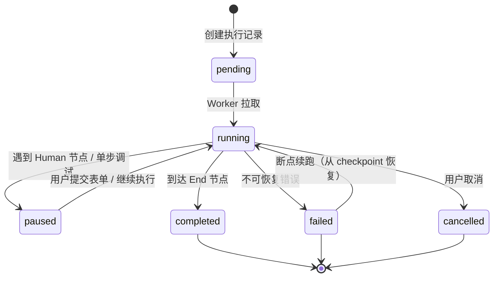
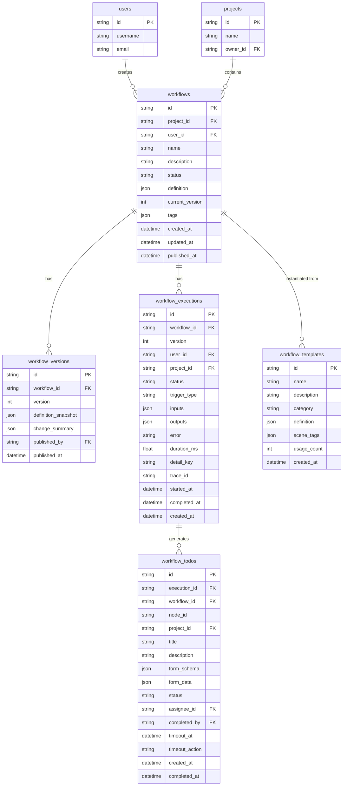
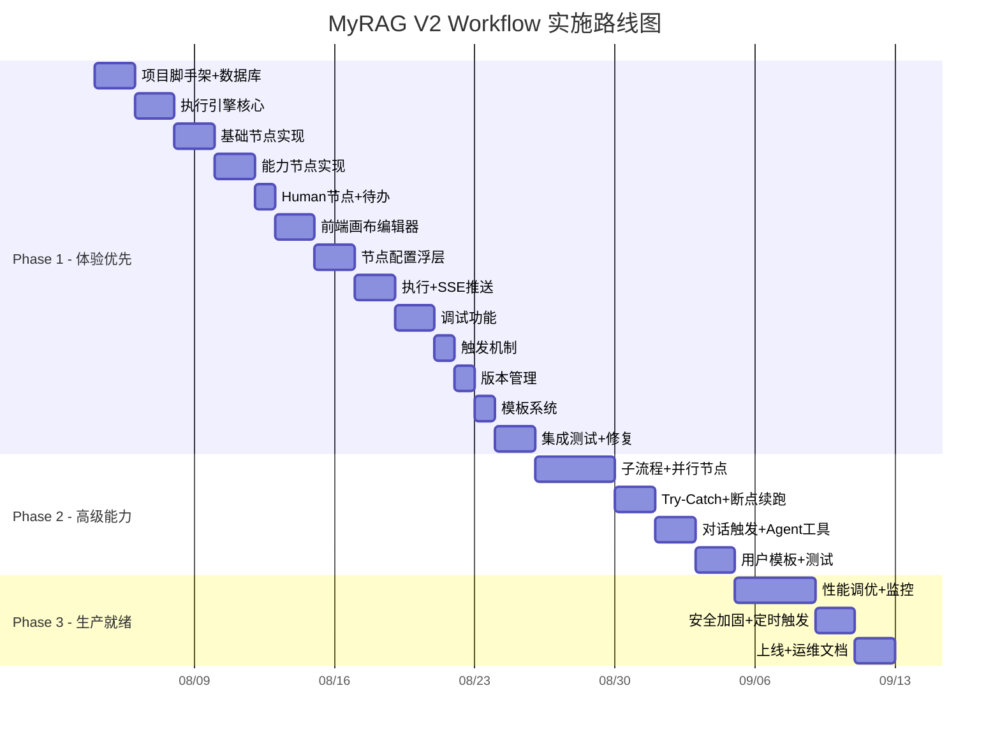

# MyRAG V2 — Workflow 通用编排引擎 需求设计文档

> **版本**：V2.0  
> **日期**：2026-07-28  
> **状态**：需求设计（Grill-Me 30 项决策评审完成）  
> **项目类型**：全新项目（MyRAG V2 子模块）  
> **关联文档**：新版RAG需求设计文档_V2.md（RAG 核心管线）

---

## 目录

1. [设计决策总表（Grill-Me 结论）](#1-设计决策总表)
2. [项目定位与目标](#2-项目定位与目标)
3. [系统架构](#3-系统架构)
4. [节点类型详细设计](#4-节点类型详细设计)
5. [变量系统与数据流](#5-变量系统与数据流)
6. [执行引擎设计](#6-执行引擎设计)
7. [触发机制](#7-触发机制)
8. [错误处理与容错](#8-错误处理与容错)
9. [人工介入设计](#9-人工介入设计)
10. [版本管理](#10-版本管理)
11. [数据库设计](#11-数据库设计)
12. [API 接口设计](#12-api-接口设计)
13. [前端设计](#13-前端设计)
14. [模板系统](#14-模板系统)
15. [可观测性](#15-可观测性)
16. [非功能性需求](#16-非功能性需求)
17. [实施路线图](#17-实施路线图)
18. [风险与限制](#18-风险与限制)
19. [验收标准](#19-验收标准)
20. [附录](#20-附录)

---

## 1. 设计决策总表

> 以下 30 项决策通过 Grill-Me 逐一追问确认，构成本文档的架构基础。

| # | 决策点 | 结论 | 理由 |
|---|--------|------|------|
| 1 | Workflow 定位 | **通用编排器**：独立于 RAG 对话的通用自动化能力 | 用户自由组合节点构建任意流程 |
| 2 | V1→V2 驱动力 | **全新项目统一技术栈 + 前端体验重做** | 复用 V1 设计思路，重点解决编辑器交互 |
| 3 | 执行引擎 | **继续 LangGraph** | 成熟、原生 checkpoint/人工介入/流式输出 |
| 4 | 节点类型 | **扩展至 15 种**（V1 的 10 种 + 5 种新增） | 新增变量赋值/模板渲染/子流程/并行/错误处理 |
| 5 | 编辑器交互 | **Dify 风格全画布模式** | 节点卡片内联配置，双击展开浮层 |
| 6 | 执行可视化 | **画布染色 + 节点内联输出 + 底部日志面板** | 回放模式放 Phase 2 |
| 7 | 触发方式 | **手动 + API + Webhook + 对话触发** | 定时（Cron）放 Phase 2 |
| 8 | 变量系统 | **类型化端口 + 全局变量池** | 连线类型校验 + 跨节点共享状态 |
| 9 | 错误处理 | **节点级重试 + 错误分支 + 断点续跑** | LangGraph checkpoint 持久化 |
| 10 | 调试体验 | **单步调试 + 单节点 Mock 测试** | 历史对比放 Phase 2 |
| 11 | 人工介入 | **待办列表 + 动态表单 + 超时处理** | 对话式介入放 Phase 2 |
| 12 | 子流程/并行 | **子流程同步为主+可选异步；并行 Join + Race** | 两种汇聚模式都支持 |
| 13 | 版本管理 | **快照式版本 + 发布确认 + 一键回滚** | 执行中实例绑定版本快照 |
| 14 | 实时推送 | **SSE 推送 + REST 控制** | 复用 RAG 对话的 SSE 模式 |
| 15 | 前端画布 | **继续 React Flow + 深度定制** | Dify 验证了此路线可行 |
| 16 | 代码沙箱 | **Docker 容器沙箱优化** | 预热池 + 细粒度资源限制 |
| 17 | 模板系统 | **内置模板 + 场景联动** | 用户模板共享放 Phase 2 |
| 18 | 并发管控 | **分层限制**（全局+用户+workflow） | Redis 计数器 + 队列 |
| 19 | RAG 集成 | **Workflow 作为 Agent 工具** | Agent 自主决定调用时机和参数 |
| 20 | 执行存储 | **摘要入库 + 详情入 MinIO + 可配置保留期** | 默认 30 天 |
| 21 | Phase 1 边界 | **体验优先**：12 种节点 + 调试 + 模板 | 子流程/并行/对话触发放 Phase 2 |
| 22 | 权限模型 | **项目级共享**（owner / viewer） | V1 已有 project_id 字段 |
| 23 | LLM 节点 | **节点级模型选择 + 完整参数面板** | 含结构化输出 JSON Mode |
| 24 | RAG 节点 | **管线参数暴露 + 分阶段多端口输出** | chunks/answer/citations/nav_anchors |
| 25 | 页面结构 | **双页面 + 待办独立页** | /workflows + /workflows/:id + /todos |
| 26 | 导入/导出 | **JSON + schema_version 版本兼容** | 依赖声明放 Phase 2 |
| 27 | 可观测性 | **Langfuse 追踪 + 列表页轻量统计** | 仪表盘/告警放 Phase 2/3 |
| 28 | 异步架构 | **Celery + LangGraph checkpoint 恢复** | Worker 崩溃后从 checkpoint 恢复 |
| 29 | 数据库设计 | **共享基础表 + JSON 定义存储** | definition 字段存 nodes/edges/variables |
| 30 | V1 数据迁移 | **不迁移** | V2 全新开始 |

---

## 2. 项目定位与目标

### 2.1 产品定位

**通用工作流编排引擎**，作为 MyRAG V2 平台的核心自动化能力模块。

- **独立于 RAG 对话**：Workflow 不是 RAG 管线的附属，而是独立的通用自动化能力
- **可视化编排**：拖拽式画布编辑器，零代码构建自动化流程
- **与 RAG 深度集成**：RAG 节点可调用 V2 完整检索管线，Workflow 可注册为 Agent 工具
- **生产级可靠**：断点续跑、错误分支、重试策略、并发管控

### 2.2 核心目标

| 目标 | 量化指标 |
|------|---------|
| 节点类型覆盖 | 15 种节点（Phase 1: 12 种，Phase 2: +3 种） |
| 编辑器体验 | 节点配置无需离开画布，双击展开浮层 |
| 执行可视化 | 实时画布染色 + 节点内联输出摘要 |
| 调试效率 | 单步调试 + 单节点 Mock，无需跑完整流程 |
| 执行可靠性 | Worker 崩溃后 checkpoint 恢复，零进度丢失 |
| 触发灵活性 | 手动 / API / Webhook / 对话触发 |
| 并发能力 | 全局 20 并发，单用户 5 并发 |

### 2.3 核心痛点（解决）

| V1 痛点 | V2 解决方案 |
|---------|------------|
| NodeConfigPanel 47KB 单文件，配置体验差 | 按节点类型拆分卡片组件，Dify 风格内联配置 |
| 执行页面与编辑器割裂（独立 Execute.tsx） | 执行在编辑器内完成，画布实时染色 |
| 无单步调试，只能全量运行 | 单步暂停/继续 + 单节点 Mock 测试 |
| 节点失败 = 整体失败，无容错 | 错误分支 + 重试 + 断点续跑 |
| 无并行分支能力 | 并行节点（Join / Race） |
| 变量传递靠字符串模板，无类型安全 | 类型化端口 + 连线校验 |
| 无版本管理，编辑即覆盖 | 快照式版本 + 发布确认 + 回滚 |
| 只能手动触发 | 手动 + API + Webhook + 对话触发 |

---

## 3. 系统架构

### 3.1 Workflow 在 V2 中的位置

```
┌─────────────────────────────────────────────────────────────────────────┐
│                        前端 (React + Vite + React Flow)                  │
│  ┌──────────┐ ┌──────────────┐ ┌──────────┐ ┌──────────┐ ┌──────────┐ │
│  │ RAG 对话 │ │ Workflow 编辑器│ │ 待办中心 │ │ 文档管理 │ │ 系统设置 │ │
│  └──────────┘ └──────────────┘ └──────────┘ └──────────┘ └──────────┘ │
└────────────────────────────────┬────────────────────────────────────────┘
                                 │ REST API / SSE
┌────────────────────────────────┼────────────────────────────────────────┐
│                          后端 (FastAPI)                                  │
│  ┌──────────────────────────────────────────────────────────────────┐   │
│  │                      API Layer (路由)                             │   │
│  │  /api/v2/workflows  /api/v2/executions  /api/v2/todos           │   │
│  └──────────────────────────────────────────────────────────────────┘   │
│  ┌──────────────────────────────────────────────────────────────────┐   │
│  │                    Service Layer (业务逻辑)                       │   │
│  │  ┌─────────────┐ ┌─────────────┐ ┌─────────────┐ ┌───────────┐ │   │
│  │  │ Workflow    │ │ Execution   │ │ Template    │ │ Trigger   │ │   │
│  │  │ Service     │ │ Service     │ │ Service     │ │ Service   │ │   │
│  │  └─────────────┘ └─────────────┘ └─────────────┘ └───────────┘ │   │
│  └──────────────────────────────────────────────────────────────────┘   │
│  ┌──────────────────────────────────────────────────────────────────┐   │
│  │                    Engine Layer (执行引擎)                        │   │
│  │  ┌─────────────────────────────────────────────────────────────┐ │   │
│  │  │              LangGraph StateGraph Engine                     │ │   │
│  │  │  ┌─────────┐ ┌─────────┐ ┌─────────┐ ┌─────────┐          │ │   │
│  │  │  │ Node    │ │ Variable│ │ Error   │ │Checkpoint│          │ │   │
│  │  │  │ Router  │ │ Resolver│ │ Handler │ │ Manager │          │ │   │
│  │  │  └─────────┘ └─────────┘ └─────────┘ └─────────┘          │ │   │
│  │  └─────────────────────────────────────────────────────────────┘ │   │
│  │  ┌─────────────────────────────────────────────────────────────┐ │   │
│  │  │                    Node Executors (15 种)                    │ │   │
│  │  │  Start│End│LLM│RAG│Code│HTTP│Condition│Loop│Human│Tool     │ │   │
│  │  │  VariableAssign│TemplateRender│SubWorkflow│Parallel│TryCatch│ │   │
│  │  └─────────────────────────────────────────────────────────────┘ │   │
│  └──────────────────────────────────────────────────────────────────┘   │
│  ┌──────────────────────────────────────────────────────────────────┐   │
│  │                    Infrastructure Layer                           │   │
│  │  ┌─────────┐ ┌─────────┐ ┌─────────┐ ┌─────────┐ ┌──────────┐ │   │
│  │  │PostgreSQL│ │  Redis  │ │  MinIO  │ │  Celery │ │ Langfuse │ │   │
│  │  │(定义+摘要)│ │(队列+计数)│ │(执行详情)│ │(Worker) │ │ (追踪)  │ │   │
│  │  └─────────┘ └─────────┘ └─────────┘ └─────────┘ └──────────┘ │   │
│  │  ┌─────────────────────────────────────────────────────────────┐ │   │
│  │  │              Docker Sandbox Pool (代码执行)                   │ │   │
│  │  └─────────────────────────────────────────────────────────────┘ │   │
│  └──────────────────────────────────────────────────────────────────┘   │
└─────────────────────────────────────────────────────────────────────────┘
```

### 3.2 技术栈

| 层面 | 选型 | 说明 |
|------|------|------|
| 执行引擎 | LangGraph StateGraph | checkpoint / 人工介入 / 流式 |
| 任务队列 | Celery + Redis | 异步执行 / 长耗时任务 |
| 画布编辑器 | React Flow | 自定义节点卡片 / 连线 / 缩放 |
| 状态管理 | Zustand | 编辑器状态 / 执行状态 |
| 实时推送 | SSE | 执行进度 / 节点状态 |
| 代码沙箱 | Docker 容器池 | 资源隔离 / 预热复用 |
| 追踪 | Langfuse | trace / span / 耗时 |
| 数据库 | PostgreSQL | 定义 / 版本 / 执行摘要 |
| 对象存储 | MinIO | 执行详情 JSON |
| 缓存/计数 | Redis | 并发控制 / 队列 |

### 3.3 数据流

```
用户操作                    后端处理                      存储
─────────                  ─────────                    ─────
拖拽编辑 ──────────→ 保存 definition JSON ──────→ PostgreSQL (workflows)
点击发布 ──────────→ 生成版本快照 ─────────────→ PostgreSQL (workflow_versions)
点击执行 ──────────→ 创建 execution 记录 ─────→ PostgreSQL (workflow_executions)
                   → 提交 Celery task ────────→ Redis (queue)
                   → Worker 拉取执行 ─────────→ LangGraph Engine
                   → 每节点完成 ──────────────→ SSE 推送前端
                   → 节点详情 ────────────────→ MinIO (JSON)
                   → 执行完成 ────────────────→ 更新 execution 状态
Webhook POST ─────→ Trigger Service ──────────→ 同上执行流程
对话 @workflow ───→ Agent tool_call ──────────→ 同上执行流程
```


---

## 4. 节点类型详细设计

### 4.1 节点总览

| # | 节点类型 | 分类 | Phase | 说明 |
|---|---------|------|-------|------|
| 1 | start | 基础 | 1 | 流程入口，定义输入变量 |
| 2 | end | 基础 | 1 | 流程出口，定义最终输出 |
| 3 | llm | 能力 | 1 | LLM 调用（支持结构化输出） |
| 4 | rag | 能力 | 1 | V2 检索管线调用 |
| 5 | code | 能力 | 1 | 代码执行（Docker 沙箱） |
| 6 | http | 能力 | 1 | HTTP 请求 |
| 7 | condition | 基础 | 1 | 条件分支（if/elif/else） |
| 8 | loop | 基础 | 1 | 循环（for/while） |
| 9 | human | 基础 | 1 | 人工介入（待办+表单） |
| 10 | tool | 能力 | 1 | 外部工具调用 |
| 11 | variable_assign | 基础 | 1 | 变量赋值/转换 |
| 12 | template_render | 基础 | 1 | 模板渲染（Jinja2） |
| 13 | sub_workflow | 高级 | 2 | 子流程调用 |
| 14 | parallel | 高级 | 2 | 并行分支（Join/Race） |
| 15 | try_catch | 高级 | 2 | 错误处理（try-catch-finally） |

### 4.2 基础节点

#### 4.2.1 Start 节点

流程入口，定义 workflow 的输入变量 schema。

**配置项：**

| 字段 | 类型 | 说明 |
|------|------|------|
| input_variables | VariableDef[] | 输入变量定义（名称+类型+默认值+描述） |
| trigger_type | enum | manual / api / webhook / chat |
| webhook_path | string | Webhook 触发时的 URL 路径（自动生成） |

**输出端口：** `output`（包含所有输入变量的 object）

**卡片摘要显示：** 触发方式 + 输入变量数量

---

#### 4.2.2 End 节点

流程出口，定义最终输出。

**配置项：**

| 字段 | 类型 | 说明 |
|------|------|------|
| output_mapping | Record<string, Expr> | 输出变量映射（从上游节点取值） |
| status | enum | success / failed（用于错误分支场景） |

**输入端口：** `input`（接收上游数据）

**卡片摘要显示：** 输出变量列表

---

#### 4.2.3 Condition 节点

条件分支，支持多条件（if / elif / else）。

**配置项：**

| 字段 | 类型 | 说明 |
|------|------|------|
| conditions | ConditionRule[] | 条件规则列表（按顺序评估） |
| default_branch | string | 默认分支（所有条件不满足时） |

**ConditionRule 结构：**

```typescript
interface ConditionRule {
  id: string;
  expression: string;       // 如: "{{llm_1.output.category}} == 'A'"
  operator: 'and' | 'or';  // 多条件组合
  sub_conditions?: {
    variable: string;       // 变量引用
    operator: '==' | '!=' | '>' | '<' | '>=' | '<=' | 'contains' | 'not_contains' | 'is_empty' | 'is_not_empty';
    value: any;
  }[];
}
```

**输出端口：** 每个条件规则一个端口 + `else` 端口

**卡片摘要显示：** 条件数量 + 第一个条件的表达式

---

#### 4.2.4 Loop 节点

循环执行，支持 for-each 和 while 两种模式。

**配置项：**

| 字段 | 类型 | 说明 |
|------|------|------|
| loop_type | 'for_each' \| 'while' | 循环类型 |
| iterate_variable | string | for_each: 要迭代的数组变量 |
| item_alias | string | for_each: 当前元素的别名 |
| index_alias | string | for_each: 当前索引的别名 |
| condition | string | while: 循环条件表达式 |
| max_iterations | number | 最大迭代次数（安全阀，默认 100） |
| break_condition | string | 可选：提前退出条件 |

**输出端口：** `body`（循环体）、`done`（循环结束后）

**卡片摘要显示：** 循环类型 + 迭代变量 + 最大次数

---

#### 4.2.5 Human 节点

人工介入，暂停 workflow 等待用户输入。

**配置项：**

| 字段 | 类型 | 说明 |
|------|------|------|
| title | string | 待办标题 |
| description | string | 待办描述 |
| form_schema | FormField[] | 动态表单定义 |
| timeout_hours | number | 超时时间（小时，默认 24） |
| timeout_action | 'skip' \| 'fail' | 超时后行为 |
| assignee | string | 指定处理人（可选，默认项目成员） |
| notification | 'in_app' \| 'email' \| 'both' | 通知方式 |

**FormField 结构：**

```typescript
interface FormField {
  name: string;
  label: string;
  type: 'text' | 'textarea' | 'number' | 'select' | 'multiselect' | 'file' | 'date' | 'checkbox';
  required: boolean;
  options?: string[];       // select/multiselect 的选项
  placeholder?: string;
  validation?: string;      // 正则校验
}
```

**输出端口：** `approved`（用户提交后）、`timeout`（超时后）

**卡片摘要显示：** 待办标题 + 表单字段数 + 超时时间

---

#### 4.2.6 Variable Assign 节点

变量赋值/转换，无需代码即可操作变量。

**配置项：**

| 字段 | 类型 | 说明 |
|------|------|------|
| assignments | Assignment[] | 赋值操作列表 |

**Assignment 结构：**

```typescript
interface Assignment {
  target: string;           // 目标变量（全局变量或节点输出）
  operation: 'set' | 'append' | 'increment' | 'concat' | 'json_parse' | 'json_stringify' | 'length' | 'slice';
  value?: any;              // set 时的值
  source?: string;          // 源变量引用
  params?: Record<string, any>;  // 操作参数（如 slice 的 start/end）
}
```

**输出端口：** `output`（赋值完成后的变量快照）

**卡片摘要显示：** 赋值操作数量 + 第一个操作摘要

---

#### 4.2.7 Template Render 节点

使用 Jinja2 模板引擎渲染文本，适合格式化输出。

**配置项：**

| 字段 | 类型 | 说明 |
|------|------|------|
| template | string | Jinja2 模板字符串 |
| output_format | 'text' \| 'markdown' \| 'html' \| 'json' | 输出格式 |
| variables | Record<string, string> | 模板变量映射（变量名 → 表达式） |

**示例模板：**

```jinja2
# 文档分析报告

## 基本信息
- 文档名称：{{ doc_name }}
- 分析时间：{{ timestamp }}

## 关键发现

{{ loop.index }}. {{ finding.title }}（置信度：{{ finding.confidence }}%）


## 总结
{{ summary }}
```

**输出端口：** `output`（渲染后的文本）

**卡片摘要显示：** 输出格式 + 模板前 50 字符预览

---

### 4.3 能力节点

#### 4.3.1 LLM 节点

调用大语言模型，支持结构化输出。

**配置项：**

| 字段 | 类型 | 说明 |
|------|------|------|
| model | 'fast' \| 'generation' \| 'custom' | 模型选择 |
| custom_model | string | 自定义模型名（model=custom 时） |
| custom_base_url | string | 自定义 API 地址 |
| system_prompt | string | 系统提示词 |
| user_prompt | string | 用户提示词（支持变量插值） |
| temperature | number | 温度（0-2，默认 0.7） |
| top_p | number | Top-P（0-1，默认 0.9） |
| max_tokens | number | 最大输出 token（默认 2048） |
| output_mode | 'text' \| 'json' | 输出模式 |
| json_schema | object | JSON Mode 时的输出 schema |
| retry_count | number | 重试次数（默认 1） |
| timeout_seconds | number | 超时（默认 60） |

**输出端口：** `output`（文本或 JSON 对象）

**卡片摘要显示：** 模型名 + prompt 前 30 字符 + 输出模式

---

#### 4.3.2 RAG 节点

调用 V2 完整检索管线，分阶段多端口输出。

**配置项：**

| 字段 | 类型 | 说明 |
|------|------|------|
| query | string | 检索问题（变量插值） |
| document_ids | string[] | 文档范围（空 = 全部） |
| scene | string | 场景预设（general / bid_doc） |
| top_k | number | 检索条数（默认 5） |
| enable_navigation | boolean | 是否启用结构导航（默认 true） |
| nav_confidence_threshold | number | 导航置信度阈值（默认 0.15） |
| enable_rerank | boolean | 是否启用 Rerank（默认 true） |
| rerank_threshold | number | Rerank 触发阈值（默认 0.02） |
| generate_answer | boolean | 是否生成答案（false = 只检索） |
| citation_format | 'inline' \| 'footnote' \| 'none' | 引用格式 |

**输出端口（4 个）：**

| 端口 | 类型 | 说明 |
|------|------|------|
| chunks | Chunk[] | 检索到的原始语义块 |
| answer | string | 生成的答案（generate_answer=true 时） |
| citations | Citation[] | 引用列表 |
| nav_anchors | Anchor[] | 导航定位结果 |

**卡片摘要显示：** 场景 + top_k + 是否生成答案

---

#### 4.3.3 Code 节点

在 Docker 沙箱中执行 Python 代码。

**配置项：**

| 字段 | 类型 | 说明 |
|------|------|------|
| language | 'python' | 编程语言（Phase 1 仅 Python） |
| code | string | 代码内容 |
| input_mapping | Record<string, string> | 输入变量映射（变量名 → 表达式） |
| output_key | string | 输出变量名（代码中 result 变量） |
| timeout_seconds | number | 执行超时（默认 30） |
| memory_limit_mb | number | 内存限制（默认 256） |
| network_access | boolean | 是否允许网络（默认 false） |
| packages | string[] | 预装包列表（默认: json, re, math, datetime） |

**代码约定：**
- 输入变量通过 `inputs` 字典访问：`inputs['variable_name']`
- 输出通过 `result` 变量返回
- 标准输出（print）记录到日志

**输出端口：** `output`（result 变量的值）

**卡片摘要显示：** 语言 + 代码前 3 行 + 超时时间

---

#### 4.3.4 HTTP 节点

发送 HTTP 请求，调用外部 API。

**配置项：**

| 字段 | 类型 | 说明 |
|------|------|------|
| method | 'GET' \| 'POST' \| 'PUT' \| 'DELETE' \| 'PATCH' | 请求方法 |
| url | string | 请求 URL（支持变量插值） |
| headers | Record<string, string> | 请求头 |
| body_type | 'none' \| 'json' \| 'form' \| 'raw' | 请求体类型 |
| body | any | 请求体内容 |
| timeout_seconds | number | 超时（默认 30） |
| retry_count | number | 重试次数（默认 0） |
| response_format | 'json' \| 'text' \| 'binary' | 响应解析格式 |
| success_condition | string | 成功判断表达式（默认: status_code < 400） |

**输出端口：** `output`（响应体）、`error`（失败时）

**卡片摘要显示：** 方法 + URL 前 40 字符

---

#### 4.3.5 Tool 节点

调用已注册的外部工具（V2 工具系统中的工具）。

**配置项：**

| 字段 | 类型 | 说明 |
|------|------|------|
| tool_id | string | 工具 ID |
| tool_name | string | 工具名称（显示用） |
| parameters | Record<string, any> | 工具参数（支持变量插值） |
| timeout_seconds | number | 超时（默认 60） |

**输出端口：** `output`（工具返回结果）

**卡片摘要显示：** 工具名称 + 参数数量

---

### 4.4 高级节点（Phase 2）

#### 4.4.1 Sub-Workflow 节点

调用另一个 workflow 作为子流程。

**配置项：**

| 字段 | 类型 | 说明 |
|------|------|------|
| workflow_id | string | 子流程 ID |
| execution_mode | 'sync' \| 'async' | 同步等待 / 异步触发 |
| input_mapping | Record<string, string> | 输入参数映射 |
| output_mapping | Record<string, string> | 输出映射（同步模式） |
| async_result_variable | string | 异步模式：结果写入的全局变量 |
| timeout_seconds | number | 同步模式超时（默认 300） |

**输出端口：** `output`（同步：子流程输出）、`triggered`（异步：触发成功）

---

#### 4.4.2 Parallel 节点

并行执行多个分支。

**配置项：**

| 字段 | 类型 | 说明 |
|------|------|------|
| mode | 'join' \| 'race' | 汇聚模式 |
| branches | string[] | 分支节点 ID 列表 |
| join_condition | 'all' \| 'any_n' | Join 模式：全部完成 / N 个完成 |
| n | number | any_n 时的 N 值 |
| error_strategy | 'fail_all' \| 'ignore_failed' | 分支失败策略 |
| timeout_seconds | number | 整体超时 |

**输出端口：** `joined`（汇聚后的合并输出）、`winner`（Race 模式的胜出分支输出）

---

#### 4.4.3 Try-Catch 节点

错误处理结构。

**配置项：**

| 字段 | 类型 | 说明 |
|------|------|------|
| try_branch | string | try 分支起始节点 ID |
| catch_branch | string | catch 分支起始节点 ID |
| finally_branch | string | finally 分支起始节点 ID（可选） |
| catch_variable | string | 错误信息写入的变量名（默认 'error'） |
| rethrow | boolean | catch 后是否重新抛出（默认 false） |

**输出端口：** `success`（try 成功）、`caught`（catch 处理完）、`finally_done`

---

## 5. 变量系统与数据流

### 5.1 类型系统

| 类型 | 标识 | 说明 | 示例 |
|------|------|------|------|
| string | `string` | 文本 | "hello" |
| number | `number` | 整数或浮点 | 42, 3.14 |
| boolean | `boolean` | 布尔值 | true |
| object | `object` | JSON 对象 | {"key": "value"} |
| array | `array` | JSON 数组 | [1, 2, 3] |
| file | `file` | 文件引用（MinIO key） | "files/doc_001.pdf" |

### 5.2 变量作用域

```
┌─────────────────────────────────────────────────┐
│  Workflow 全局变量池 (global_variables)          │
│  ┌───────────────────────────────────────────┐  │
│  │  workflow.input.*    (Start 节点输入)      │  │
│  │  workflow.output.*   (End 节点输出)        │  │
│  │  workflow.custom.*   (用户自定义全局变量)   │  │
│  └───────────────────────────────────────────┘  │
│                                                 │
│  ┌───────────────────────────────────────────┐  │
│  │  节点作用域 (node_outputs)                 │  │
│  │  {node_id}.output.*  (节点输出)            │  │
│  │  {node_id}.error     (节点错误信息)        │  │
│  │  {node_id}.metadata  (执行元数据:耗时等)   │  │
│  └───────────────────────────────────────────┘  │
│                                                 │
│  ┌───────────────────────────────────────────┐  │
│  │  循环作用域 (loop scope)                   │  │
│  │  loop.item      (当前迭代元素)             │  │
│  │  loop.index     (当前索引)                 │  │
│  │  loop.collector (累加收集器)               │  │
│  └───────────────────────────────────────────┘  │
└─────────────────────────────────────────────────┘
```

### 5.3 变量引用语法

```
{{workflow.input.question}}          # Start 节点输入
{{llm_1.output.text}}               # LLM 节点输出
{{rag_1.chunks[0].content}}         # RAG 节点第一个 chunk
{{loop.item.name}}                  # 循环当前元素
{{workflow.custom.counter}}         # 全局自定义变量
{{http_1.output.data.items | length}}  # 管道表达式
```

### 5.4 类型化端口与连线校验

每个节点定义 typed inputs/outputs：

```typescript
interface PortDefinition {
  name: string;
  type: 'string' | 'number' | 'boolean' | 'object' | 'array' | 'file' | 'any';
  description: string;
  required: boolean;
  schema?: object;  // object/array 类型的 JSON Schema
}

interface NodeDefinition {
  id: string;
  type: string;
  inputs: PortDefinition[];
  outputs: PortDefinition[];
}
```

**连线校验规则：**
- 源端口类型必须与目标端口类型兼容
- `any` 类型兼容所有类型
- `object` 可以连接到 `object`（schema 校验为警告，不阻断）
- `array` 可以连接到 `array`
- 不兼容连线：前端显示红色虚线 + 警告图标，允许保存但执行时报错

### 5.5 全局变量池操作

| 操作 | 说明 | 使用场景 |
|------|------|----------|
| read | 读取全局变量 | 任意节点 |
| write | 写入/覆盖全局变量 | Variable Assign 节点 |
| append | 向数组变量追加元素 | 循环中收集结果 |
| increment | 数值变量 +N | 计数器 |
| delete | 删除全局变量 | 清理临时变量 |

**全局变量定义（Start 节点或独立配置）：**

```json
{
  "global_variables": [
    {"name": "counter", "type": "number", "default": 0},
    {"name": "results", "type": "array", "default": []},
    {"name": "report", "type": "string", "default": ""}
  ]
}
```


---

## 6. 执行引擎设计

### 6.1 引擎架构

基于 LangGraph StateGraph 构建，核心组件：

```
┌─────────────────────────────────────────────────────────────┐
│                    WorkflowEngine                             │
│                                                             │
│  ┌─────────────┐    ┌─────────────┐    ┌─────────────┐    │
│  │ GraphBuilder│    │ NodeRouter  │    │ StateManager│    │
│  │ (定义→图)   │    │ (类型→执行器)│    │ (状态管理)  │    │
│  └─────────────┘    └─────────────┘    └─────────────┘    │
│                                                             │
│  ┌─────────────┐    ┌─────────────┐    ┌─────────────┐    │
│  │ Variable    │    │ Checkpoint  │    │ Progress    │    │
│  │ Resolver    │    │ Manager     │    │ Emitter     │    │
│  │ (变量解析)  │    │ (断点管理)  │    │ (SSE 推送)  │    │
│  └─────────────┘    └─────────────┘    └─────────────┘    │
│                                                             │
│  ┌─────────────────────────────────────────────────────┐    │
│  │              Node Executors (15 种)                  │    │
│  │  BaseNode → LLMNode / RAGNode / CodeNode / ...      │    │
│  └─────────────────────────────────────────────────────┘    │
└─────────────────────────────────────────────────────────────┘
```

### 6.2 执行状态机



### 6.3 WorkflowState 定义

```python
class WorkflowState(TypedDict):
    """工作流执行状态（LangGraph State）"""
    # 标识
    workflow_id: str
    execution_id: str
    thread_id: str
    user_id: str
    project_id: str

    # 执行上下文
    variables: Dict[str, Any]           # 全局变量池
    node_outputs: Dict[str, Dict[str, Any]]  # 各节点输出
    current_node: str                   # 当前执行节点

    # 状态追踪
    status: str                         # pending/running/paused/completed/failed/cancelled
    error: Optional[str]               # 错误信息
    started_at: float                  # 开始时间戳
    node_timings: Dict[str, float]     # 各节点耗时

    # 人工介入
    human_prompt: Optional[str]        # 待办标题
    human_form_schema: Optional[Dict]  # 表单 schema
    human_input: Optional[Dict]        # 用户提交的数据

    # 调试模式
    debug_mode: bool                   # 是否单步调试
    debug_pause: bool                  # 是否暂停等待继续

    # 循环上下文
    loop_stack: List[Dict]             # 循环嵌套栈
```

### 6.4 GraphBuilder：定义 → StateGraph

```python
class GraphBuilder:
    """将 workflow definition JSON 转换为 LangGraph StateGraph"""

    async def build(
        self,
        definition: Dict[str, Any],
        execution_id: str,
        debug_mode: bool = False,
    ) -> CompiledGraph:
        nodes = definition["nodes"]
        edges = definition["edges"]
        variables = definition.get("global_variables", [])

        graph = StateGraph(WorkflowState)

        # 1. 注册节点
        for node_def in nodes:
            executor = NodeRouter.create(node_def)  # 工厂方法
            graph.add_node(node_def["id"], executor.execute)

        # 2. 注册边（含条件边）
        for edge in edges:
            if edge.get("condition"):
                # 条件边：condition 节点的输出端口
                graph.add_conditional_edges(
                    edge["source"],
                    self._make_condition_fn(edge),
                    {edge["sourceHandle"]: edge["target"]}
                )
            else:
                graph.add_edge(edge["source"], edge["target"])

        # 3. 设置入口和出口
        start_node = next(n for n in nodes if n["type"] == "start")
        graph.set_entry_point(start_node["id"])

        # 4. 编译（含 checkpoint）
        checkpointer = PostgresSaver(conn_string)
        return graph.compile(
            checkpointer=checkpointer,
            interrupt_before=["human_*"] if not debug_mode else ["*"],
        )
```

### 6.5 NodeRouter：节点工厂

```python
class NodeRouter:
    """根据节点类型创建对应的执行器"""

    NODE_REGISTRY = {
        "start": StartNode,
        "end": EndNode,
        "llm": LLMNode,
        "rag": RAGNode,
        "code": CodeNode,
        "http": HTTPNode,
        "condition": ConditionNode,
        "loop": LoopNode,
        "human": HumanNode,
        "tool": ToolNode,
        "variable_assign": VariableAssignNode,
        "template_render": TemplateRenderNode,
        "sub_workflow": SubWorkflowNode,       # Phase 2
        "parallel": ParallelNode,             # Phase 2
        "try_catch": TryCatchNode,            # Phase 2
    }

    @classmethod
    def create(cls, node_def: Dict) -> BaseNode:
        node_type = node_def["type"]
        node_class = cls.NODE_REGISTRY.get(node_type)
        if not node_class:
            raise ValueError(f"Unknown node type: {node_type}")
        return node_class(node_def)
```

### 6.6 BaseNode 接口

```python
class BaseNode(ABC):
    """节点执行器基类"""

    def __init__(self, node_def: Dict[str, Any]):
        self.node_id = node_def["id"]
        self.node_type = node_def["type"]
        self.config = node_def.get("data", {}).get("config", {})
        self.inputs = node_def.get("data", {}).get("inputs", [])
        self.outputs = node_def.get("data", {}).get("outputs", [])

    @abstractmethod
    async def execute(self, state: WorkflowState) -> Dict[str, Any]:
        """执行节点逻辑，返回状态更新"""
        pass

    def resolve_input(self, state: WorkflowState, expr: str) -> Any:
        """解析输入表达式（变量插值）"""
        return VariableResolver.resolve(expr, state)

    def emit_progress(self, event: ProgressEvent):
        """发送执行进度事件（SSE）"""
        ProgressEmitter.emit(self.execution_id, event)

    def get_retry_config(self) -> RetryConfig:
        """获取重试配置"""
        return RetryConfig(
            max_retries=self.config.get("retry_count", 0),
            backoff=self.config.get("retry_backoff", "fixed"),
            interval=self.config.get("retry_interval", 5),
        )
```

### 6.7 Celery 任务集成

```python
# worker/tasks.py
from celery import shared_task

@shared_task(bind=True, max_retries=3)
def execute_workflow_task(self, execution_id: str, workflow_id: str, inputs: dict):
    """Celery 任务：执行 workflow"""
    import asyncio
    asyncio.run(_execute_workflow(execution_id, workflow_id, inputs))

async def _execute_workflow(execution_id: str, workflow_id: str, inputs: dict):
    # 1. 加载 workflow 定义（从版本快照）
    # 2. 构建 StateGraph
    # 3. 检查是否有 checkpoint（断点续跑）
    # 4. 执行 graph.invoke() 或 graph.stream()
    # 5. 更新执行记录状态
    # 6. 写入执行详情到 MinIO
    pass
```

### 6.8 单步调试模式

```python
# 调试模式下的执行流程
async def debug_execute(execution_id: str):
    graph = await build_graph(definition, execution_id, debug_mode=True)

    # interrupt_before=["*"] 使每个节点执行前暂停
    config = {"configurable": {"thread_id": execution_id}}

    # 首次启动
    async for event in graph.astream(initial_state, config):
        emit_node_start(event)
        break  # 暂停在第一个节点前

    # 用户点击"继续"时调用
    async def debug_continue(execution_id: str):
        async for event in graph.astream(None, config):
            emit_node_complete(event)
            break  # 执行一个节点后再次暂停

    # 用户点击"单节点测试"时调用
    async def debug_test_node(node_id: str, mock_inputs: dict):
        node = NodeRouter.create(get_node_def(node_id))
        mock_state = build_mock_state(mock_inputs)
        result = await node.execute(mock_state)
        return result
```

---

## 7. 触发机制

### 7.1 触发方式总览

| 触发方式 | Phase | 说明 | 入口 |
|---------|-------|------|------|
| 手动触发 | 1 | 前端点击"执行"按钮 | POST /api/v2/workflows/{id}/execute |
| API 触发 | 1 | 外部系统 REST 调用 | POST /api/v2/workflows/{id}/execute（带 API Key） |
| Webhook 触发 | 1 | 每个 workflow 生成唯一 URL | POST /api/v2/webhooks/{webhook_token} |
| 对话触发 | 2 | Agent tool_call 调用 | Agent 内部调用 |
| 定时触发 | 2 | Cron 表达式 | Celery Beat |

### 7.2 手动触发

```
POST /api/v2/workflows/{workflow_id}/execute
Authorization: Bearer <jwt>
Content-Type: application/json

{
  "inputs": {
    "question": "分析这份标书的资质要求",
    "document_id": "doc_001"
  },
  "version": "latest",        // "latest" 或具体版本号
  "debug": false              // true = 单步调试模式
}

Response (202 Accepted):
{
  "code": 0,
  "data": {
    "execution_id": "exec_abc123",
    "status": "pending",
    "sse_url": "/api/v2/executions/exec_abc123/stream"
  }
}
```

### 7.3 Webhook 触发

每个已发布的 workflow 自动生成 Webhook URL：

```
URL: POST /api/v2/webhooks/{webhook_token}
Content-Type: application/json
X-Webhook-Secret: <optional_secret>

{
  "inputs": { ... }    // 与 Start 节点 input_variables 对应
}

Response (202):
{
  "execution_id": "exec_xyz789",
  "status": "pending"
}
```

**Webhook 配置（Start 节点）：**

| 字段 | 说明 |
|------|------|
| webhook_token | 自动生成的 UUID（不可猜测） |
| webhook_secret | 可选签名密钥（HMAC-SHA256 校验） |
| enabled | 是否启用 |
| allowed_ips | IP 白名单（可选） |
| rate_limit | 速率限制（默认 60 次/分钟） |

### 7.4 对话触发（Phase 2）

Workflow 注册为 Agent 工具：

```python
# 工具注册 schema
{
    "name": "workflow_{workflow_id}",
    "description": workflow.description,  # 用户填写的描述
    "parameters": {
        "type": "object",
        "properties": {
            # 从 Start 节点的 input_variables 自动生成
            "question": {"type": "string", "description": "分析问题"},
            "document_id": {"type": "string", "description": "文档ID"}
        },
        "required": ["question"]
    }
}
```

Agent 通过 tool_call 触发 workflow 执行，执行结果回传 Agent 做进一步推理。

### 7.5 触发 → 执行流程

```
触发请求 ──→ TriggerService.validate()
              │
              ├─ 校验 workflow 状态（必须 published）
              ├─ 校验并发限制（Redis 计数器）
              ├─ 校验输入变量（类型 + 必填）
              │
              └─→ ExecutionService.create()
                   │
                   ├─ 创建 execution 记录（status=pending）
                   ├─ 绑定版本快照
                   ├─ 提交 Celery task
                   │
                   └─→ 返回 execution_id + SSE URL
```

---

## 8. 错误处理与容错

### 8.1 错误分层

```
┌─────────────────────────────────────────────────────────┐
│  Level 1: 节点级重试                                     │
│  节点配置 retry_count + backoff，自动重试                 │
│  适用：网络抖动、LLM 超时、临时性错误                     │
├─────────────────────────────────────────────────────────┤
│  Level 2: 错误分支                                       │
│  重试耗尽后走 error 输出端口                              │
│  用户可连线到错误处理逻辑（记录日志/发通知/降级）          │
├─────────────────────────────────────────────────────────┤
│  Level 3: 断点续跑                                       │
│  不可恢复错误 → workflow 标记 failed                      │
│  用户可从最后成功节点恢复执行                             │
├─────────────────────────────────────────────────────────┤
│  Level 4: 全局异常（Phase 2 try_catch 节点）             │
│  workflow 级 try-catch-finally 结构                      │
└─────────────────────────────────────────────────────────┘
```

### 8.2 节点级重试

```python
class RetryConfig:
    max_retries: int = 0              # 最大重试次数
    backoff: str = "fixed"            # fixed / exponential
    interval: float = 5.0             # 固定间隔（秒）
    max_interval: float = 60.0        # 指数退避最大间隔
    retryable_errors: List[str] = []  # 可重试的错误类型（空=全部）

async def execute_with_retry(node: BaseNode, state: WorkflowState) -> NodeResult:
    config = node.get_retry_config()
    last_error = None

    for attempt in range(config.max_retries + 1):
        try:
            result = await node.execute(state)
            return result
        except Exception as e:
            last_error = e
            if attempt < config.max_retries:
                if is_retryable(e, config.retryable_errors):
                    wait = calc_backoff(attempt, config)
                    await asyncio.sleep(wait)
                    node.emit_progress(ProgressEvent(
                        type="retry",
                        message=f"重试 {attempt+1}/{config.max_retries}: {str(e)}"
                    ))
                else:
                    break  # 不可重试的错误，直接失败

    return NodeResult(success=False, error=str(last_error))
```

### 8.3 错误分支

节点执行失败（重试耗尽）后的处理：

```
节点输出端口：
  ├─ output (成功)  ──→ 下游正常节点
  └─ error (失败)   ──→ 错误处理节点（可选连线）

如果 error 端口没有连线：
  → workflow 整体标记 failed
  → 记录错误信息到 execution.error

如果 error 端口有连线：
  → 走错误分支（如：发通知、记录日志、降级处理）
  → 错误分支执行完后，workflow 可以继续或终止
```

**错误输出数据结构：**

```json
{
  "error": {
    "node_id": "http_1",
    "node_type": "http",
    "error_type": "TimeoutError",
    "message": "Request to https://api.example.com timed out after 30s",
    "attempt": 3,
    "timestamp": "2026-07-28T10:30:00Z",
    "traceback": "..."
  }
}
```

### 8.4 断点续跑

基于 LangGraph checkpoint 实现：

```python
# 每个节点执行完成后，LangGraph 自动保存 checkpoint 到 PostgreSQL
# checkpoint 包含完整的 WorkflowState 快照

async def resume_execution(execution_id: str):
    """从最后成功的 checkpoint 恢复执行"""
    # 1. 加载 execution 记录
    execution = await get_execution(execution_id)
    assert execution.status == "failed"

    # 2. 获取最后的 checkpoint
    config = {"configurable": {"thread_id": execution_id}}
    checkpoint = await checkpointer.aget(config)

    # 3. 从 checkpoint 恢复 graph 执行
    graph = await build_graph(execution.workflow.definition, execution_id)
    async for event in graph.astream(None, config):
        # 从失败节点的下一个节点继续
        emit_progress(event)

    # 4. 更新状态
    execution.status = "running"
    await save_execution(execution)
```

### 8.5 超时控制

| 层级 | 默认值 | 可配置 | 说明 |
|------|--------|--------|------|
| 节点级 | 60s（LLM）/ 30s（HTTP/Code） | ✅ | 单节点执行超时 |
| Workflow 级 | 3600s（1小时） | ✅ | 整体执行超时（不含 human 等待） |
| Human 等待 | 24h | ✅ | 人工介入等待超时 |
| Webhook 响应 | 5s | ❌ | Webhook 触发后返回 202 的超时 |

### 8.6 取消执行

```
POST /api/v2/executions/{execution_id}/cancel

处理逻辑：
1. 设置 execution.status = "cancelling"
2. 通过 Redis pub/sub 通知 Worker
3. Worker 在当前节点完成后检查取消标志
4. 如果节点正在执行 LLM 调用，中断流式请求
5. 最终状态设为 "cancelled"
6. 释放并发计数
```


---

## 9. 人工介入设计

### 9.1 整体流程

```mermaid
sequenceDiagram
    participant W as Workflow Engine
    participant DB as PostgreSQL
    participant R as Redis
    participant U as 用户（前端）
    participant N as 通知服务

    W->>DB: 执行到 Human 节点，创建 Todo 记录
    W->>W: workflow 状态 → paused
    W->>N: 发送通知（站内 + 可选邮件）
    N->>U: 推送"有待审批"通知
    U->>DB: 打开 /todos 页面，查看待办列表
    U->>U: 点击待办，查看动态表单
    U->>DB: 提交表单数据
    DB->>R: 发布 resume 事件
    R->>W: Worker 收到 resume 信号
    W->>W: workflow 状态 → running，继续执行
    W->>DB: 更新 Todo 状态 → completed
```



### 9.2 Todo 数据模型

```python
class WorkflowTodo(Base):
    """人工介入待办记录"""
    __tablename__ = "workflow_todos"

    id = Column(String(36), primary_key=True)
    execution_id = Column(String(36), ForeignKey("workflow_executions.id"))
    workflow_id = Column(String(36), ForeignKey("workflows.id"))
    node_id = Column(String(100))          # Human 节点 ID
    project_id = Column(String(36))

    # 待办内容
    title = Column(String(200))            # 待办标题
    description = Column(Text)             # 待办描述
    form_schema = Column(JSON)             # 动态表单 schema
    form_data = Column(JSON)               # 用户提交的数据

    # 状态
    status = Column(String(20))            # pending / completed / timeout / cancelled
    assignee_id = Column(String(36))       # 指定处理人（可选）
    completed_by = Column(String(36))      # 实际处理人

    # 超时
    timeout_at = Column(DateTime)          # 超时时间
    timeout_action = Column(String(20))    # skip / fail

    # 时间戳
    created_at = Column(DateTime)
    completed_at = Column(DateTime)
```

### 9.3 动态表单渲染

前端根据 `form_schema` 渲染表单：

```typescript
// 表单字段类型 → Ant Design 组件映射
const FIELD_COMPONENT_MAP = {
  text: Input,
  textarea: Input.TextArea,
  number: InputNumber,
  select: Select,
  multiselect: Select,        // mode="multiple"
  file: Upload,
  date: DatePicker,
  checkbox: Checkbox.Group,
};

// 渲染逻辑
function TodoForm({ schema, onSubmit }: Props) {
  return (
    <Form onFinish={onSubmit}>
      {schema.map(field => (
        <Form.Item
          key={field.name}
          label={field.label}
          name={field.name}
          rules={[{ required: field.required }]}
        >
          {renderField(field)}
        </Form.Item>
      ))}
      <Button type="primary" htmlType="submit">提交</Button>
    </Form>
  );
}
```

### 9.4 超时处理

```python
# Celery Beat 定时任务：每分钟检查超时的 Todo
@shared_task
def check_todo_timeout():
    now = datetime.utcnow()
    expired_todos = db.query(WorkflowTodo).filter(
        WorkflowTodo.status == "pending",
        WorkflowTodo.timeout_at < now,
    ).all()

    for todo in expired_todos:
        todo.status = "timeout"
        db.commit()

        if todo.timeout_action == "skip":
            # 跳过 human 节点，workflow 继续（使用默认值）
            resume_workflow(todo.execution_id, node_id=todo.node_id, input={})
        elif todo.timeout_action == "fail":
            # 标记 workflow 失败
            fail_execution(todo.execution_id, reason=f"Human node timeout: {todo.title}")
```

### 9.5 通知机制

| 通知方式 | 实现 | 内容 |
|---------|------|------|
| 站内通知 | WebSocket 推送 + 通知中心 | "【待审批】{title}，来自 workflow {name}" |
| 邮件（可选） | SMTP / 第三方邮件服务 | 含待办链接，点击直达表单 |

---

## 10. 版本管理

### 10.1 版本模型

```
┌─────────────────────────────────────────────────────────┐
│  Workflow (主表)                                         │
│  ├─ status: draft / published / archived                │
│  ├─ definition: JSON (当前编辑中的定义)                  │
│  └─ current_version: int (当前已发布版本号)              │
│                                                         │
│  WorkflowVersion (版本快照表)                            │
│  ├─ version: int (1, 2, 3, ...)                        │
│  ├─ definition_snapshot: JSON (不可变)                  │
│  ├─ change_summary: JSON (变更摘要)                     │
│  ├─ published_by: user_id                              │
│  └─ published_at: timestamp                            │
│                                                         │
│  WorkflowExecution (执行记录)                            │
│  └─ version: int (绑定的版本快照号)                     │
└─────────────────────────────────────────────────────────┘
```

### 10.2 发布流程

```
用户点击"发布" ──→ 前端请求 POST /workflows/{id}/publish
                    │
                    ├─ 后端对比当前 definition 与上一版本快照
                    ├─ 生成变更摘要（新增/删除/修改的节点）
                    │
                    └─→ 返回变更摘要给前端
                         │
                         └─→ 前端显示确认弹窗：
                              "本次发布变更：
                               + 新增节点: template_render_1
                               ~ 修改节点: llm_1 (prompt 变更)
                               - 删除节点: http_2
                               确认发布？"
                              │
                              ├─ 确认 → 创建版本快照，status → published
                              └─ 取消 → 不做任何操作
```

### 10.3 变更摘要生成

```python
def generate_change_summary(old_def: Dict, new_def: Dict) -> Dict:
    """对比两个版本的 definition，生成变更摘要"""
    old_nodes = {n["id"]: n for n in old_def.get("nodes", [])}
    new_nodes = {n["id"]: n for n in new_def.get("nodes", [])}

    added = [n for n in new_nodes if n not in old_nodes]
    removed = [n for n in old_nodes if n not in new_nodes]
    modified = []

    for node_id in set(old_nodes) & set(new_nodes):
        if old_nodes[node_id] != new_nodes[node_id]:
            modified.append({
                "id": node_id,
                "type": new_nodes[node_id]["type"],
                "changes": diff_node(old_nodes[node_id], new_nodes[node_id])
            })

    return {
        "added": [{"id": n, "type": new_nodes[n]["type"]} for n in added],
        "removed": [{"id": n, "type": old_nodes[n]["type"]} for n in removed],
        "modified": modified,
        "edge_changes": diff_edges(old_def, new_def),
    }
```

### 10.4 回滚操作

```
POST /api/v2/workflows/{id}/rollback
{
  "target_version": 3
}

处理逻辑：
1. 从 workflow_versions 表取 version=3 的 definition_snapshot
2. 覆盖 workflow.definition
3. 不改变 current_version（回滚后需要重新发布才生效）
4. 记录操作日志
```

### 10.5 执行中实例保护

- 执行记录绑定 `version` 字段（发布时的版本号）
- 执行时从 `workflow_versions` 表读取对应版本的 `definition_snapshot`
- 编辑/发布新版本不影响正在执行的实例
- 删除 workflow 时，如有 running 状态的执行，拒绝删除

---

## 11. 数据库设计

### 11.1 ER 关系图



### 11.2 DDL

```sql
-- 工作流定义表
CREATE TABLE workflows (
    id              VARCHAR(36) PRIMARY KEY DEFAULT gen_random_uuid()::text,
    project_id      VARCHAR(36) REFERENCES projects(id) ON DELETE CASCADE,
    user_id         VARCHAR(36) NOT NULL REFERENCES users(id),
    name            VARCHAR(200) NOT NULL,
    description     TEXT,
    status          VARCHAR(20) NOT NULL DEFAULT 'draft',  -- draft/published/archived
    definition      JSONB,                                  -- {nodes, edges, global_variables}
    current_version INTEGER DEFAULT 0,
    tags            JSONB DEFAULT '[]',
    webhook_token   VARCHAR(36) UNIQUE,                    -- Webhook 触发 token
    webhook_secret  VARCHAR(100),                          -- Webhook 签名密钥
    webhook_enabled BOOLEAN DEFAULT false,
    created_at      TIMESTAMP NOT NULL DEFAULT NOW(),
    updated_at      TIMESTAMP NOT NULL DEFAULT NOW(),
    published_at    TIMESTAMP
);

CREATE INDEX idx_workflows_project ON workflows(project_id);
CREATE INDEX idx_workflows_user ON workflows(user_id);
CREATE INDEX idx_workflows_status ON workflows(status);
CREATE INDEX idx_workflows_webhook ON workflows(webhook_token) WHERE webhook_enabled;

-- 工作流版本快照表
CREATE TABLE workflow_versions (
    id                  VARCHAR(36) PRIMARY KEY DEFAULT gen_random_uuid()::text,
    workflow_id         VARCHAR(36) NOT NULL REFERENCES workflows(id) ON DELETE CASCADE,
    version             INTEGER NOT NULL,
    definition_snapshot JSONB NOT NULL,
    change_summary      JSONB,
    published_by        VARCHAR(36) REFERENCES users(id),
    published_at        TIMESTAMP NOT NULL DEFAULT NOW(),
    UNIQUE(workflow_id, version)
);

CREATE INDEX idx_wf_versions_workflow ON workflow_versions(workflow_id);

-- 工作流执行记录表
CREATE TABLE workflow_executions (
    id              VARCHAR(36) PRIMARY KEY DEFAULT gen_random_uuid()::text,
    workflow_id     VARCHAR(36) NOT NULL REFERENCES workflows(id) ON DELETE CASCADE,
    version         INTEGER NOT NULL,
    user_id         VARCHAR(36) REFERENCES users(id),
    project_id      VARCHAR(36) REFERENCES projects(id),
    status          VARCHAR(20) NOT NULL DEFAULT 'pending',
                    -- pending/running/paused/completed/failed/cancelled
    trigger_type    VARCHAR(20) NOT NULL DEFAULT 'manual',
                    -- manual/api/webhook/chat/schedule
    inputs          JSONB,
    outputs         JSONB,
    error           TEXT,
    duration_ms     FLOAT,
    detail_key      VARCHAR(200),     -- MinIO 对象 key（节点级详情）
    trace_id        VARCHAR(100),     -- Langfuse trace ID
    started_at      TIMESTAMP,
    completed_at    TIMESTAMP,
    created_at      TIMESTAMP NOT NULL DEFAULT NOW()
);

CREATE INDEX idx_wf_exec_workflow ON workflow_executions(workflow_id);
CREATE INDEX idx_wf_exec_status ON workflow_executions(status);
CREATE INDEX idx_wf_exec_project ON workflow_executions(project_id);
CREATE INDEX idx_wf_exec_created ON workflow_executions(created_at DESC);

-- 工作流待办表（人工介入）
CREATE TABLE workflow_todos (
    id              VARCHAR(36) PRIMARY KEY DEFAULT gen_random_uuid()::text,
    execution_id    VARCHAR(36) NOT NULL REFERENCES workflow_executions(id) ON DELETE CASCADE,
    workflow_id     VARCHAR(36) NOT NULL REFERENCES workflows(id),
    node_id         VARCHAR(100) NOT NULL,
    project_id      VARCHAR(36) REFERENCES projects(id),
    title           VARCHAR(200) NOT NULL,
    description     TEXT,
    form_schema     JSONB,
    form_data       JSONB,
    status          VARCHAR(20) NOT NULL DEFAULT 'pending',
                    -- pending/completed/timeout/cancelled
    assignee_id     VARCHAR(36) REFERENCES users(id),
    completed_by    VARCHAR(36) REFERENCES users(id),
    timeout_at      TIMESTAMP,
    timeout_action  VARCHAR(20) DEFAULT 'fail',  -- skip/fail
    created_at      TIMESTAMP NOT NULL DEFAULT NOW(),
    completed_at    TIMESTAMP
);

CREATE INDEX idx_wf_todos_status ON workflow_todos(status);
CREATE INDEX idx_wf_todos_project ON workflow_todos(project_id);
CREATE INDEX idx_wf_todos_assignee ON workflow_todos(assignee_id) WHERE status = 'pending';
CREATE INDEX idx_wf_todos_timeout ON workflow_todos(timeout_at) WHERE status = 'pending';

-- 工作流模板表
CREATE TABLE workflow_templates (
    id              VARCHAR(36) PRIMARY KEY DEFAULT gen_random_uuid()::text,
    name            VARCHAR(200) NOT NULL,
    description     TEXT,
    category        VARCHAR(50),       -- rag/automation/approval/extraction
    definition      JSONB NOT NULL,
    scene_tags      JSONB DEFAULT '[]',  -- ["general", "bid_doc"]
    icon            VARCHAR(50),
    usage_count     INTEGER DEFAULT 0,
    created_at      TIMESTAMP NOT NULL DEFAULT NOW()
);

CREATE INDEX idx_wf_templates_category ON workflow_templates(category);
CREATE INDEX idx_wf_templates_scene ON workflow_templates USING GIN(scene_tags);

-- LangGraph Checkpoint 表（LangGraph 内置，PostgresSaver 自动创建）
-- checkpoints / checkpoint_writes / checkpoint_blobs
-- 由 LangGraph PostgresSaver 管理，无需手动创建
```

### 11.3 MinIO 存储结构

```
minio-bucket: myrag-workflow
└── executions/
    └── {execution_id}/
        ├── summary.json          # 执行摘要（冗余备份）
        ├── nodes/
        │   ├── {node_id}_1.json  # 第 1 次执行的节点详情
        │   ├── {node_id}_2.json  # 重试后的节点详情
        │   └── ...
        └── state/
            └── final_state.json  # 最终状态快照
```

**节点详情 JSON 结构：**

```json
{
  "node_id": "llm_1",
  "node_type": "llm",
  "attempt": 1,
  "started_at": "2026-07-28T10:00:00Z",
  "completed_at": "2026-07-28T10:00:02.5Z",
  "duration_ms": 2500,
  "inputs": {
    "system_prompt": "你是一个...",
    "user_prompt": "分析以下文档...",
    "model": "qwen2.5-72b-instruct",
    "temperature": 0.7
  },
  "outputs": {
    "output": "根据文档分析...",
    "tokens_used": {"prompt": 1200, "completion": 450}
  },
  "logs": ["[INFO] Model call started", "[INFO] Received 450 tokens"],
  "error": null
}
```


---

## 12. API 接口设计

> 基础路径: `/api/v2`。所有接口返回统一格式 `{ code, message, data }`（SSE 接口除外）。

### 12.1 接口总览

| # | 方法 | 路径 | 说明 | 认证 |
|---|------|------|------|------|
| 1 | POST | /workflows | 创建 workflow | ✅ |
| 2 | GET | /workflows | workflow 列表（分页） | ✅ |
| 3 | GET | /workflows/{id} | workflow 详情（含 definition） | ✅ |
| 4 | PUT | /workflows/{id} | 更新 workflow（定义/名称/描述） | ✅ |
| 5 | DELETE | /workflows/{id} | 删除 workflow | ✅ |
| 6 | POST | /workflows/{id}/publish | 发布 workflow | ✅ |
| 7 | POST | /workflows/{id}/rollback | 回滚到指定版本 | ✅ |
| 8 | GET | /workflows/{id}/versions | 版本历史列表 | ✅ |
| 9 | POST | /workflows/{id}/execute | 执行 workflow | ✅ |
| 10 | POST | /workflows/{id}/duplicate | 复制 workflow | ✅ |
| 11 | POST | /workflows/{id}/export | 导出 JSON | ✅ |
| 12 | POST | /workflows/import | 导入 JSON | ✅ |
| 13 | GET | /executions | 执行历史列表（分页） | ✅ |
| 14 | GET | /executions/{id} | 执行详情（摘要） | ✅ |
| 15 | GET | /executions/{id}/nodes/{nodeId} | 节点执行详情（从 MinIO） | ✅ |
| 16 | GET | /executions/{id}/stream | SSE 执行状态流 | ✅ |
| 17 | POST | /executions/{id}/cancel | 取消执行 | ✅ |
| 18 | POST | /executions/{id}/resume | 断点续跑 | ✅ |
| 19 | POST | /executions/{id}/debug/continue | 单步调试：继续下一步 | ✅ |
| 20 | POST | /executions/{id}/debug/test-node | 单节点 Mock 测试 | ✅ |
| 21 | GET | /todos | 待办列表（全局） | ✅ |
| 22 | GET | /todos/{id} | 待办详情（含表单 schema） | ✅ |
| 23 | POST | /todos/{id}/submit | 提交待办表单 | ✅ |
| 24 | GET | /templates | 模板列表 | ✅ |
| 25 | GET | /templates/{id} | 模板详情 | ✅ |
| 26 | POST | /templates/{id}/instantiate | 从模板创建 workflow | ✅ |
| 27 | POST | /webhooks/{token} | Webhook 触发 | ❌（token 认证） |
| 28 | GET | /workflows/{id}/webhook-config | Webhook 配置 | ✅ |
| 29 | PUT | /workflows/{id}/webhook-config | 更新 Webhook 配置 | ✅ |

### 12.2 核心接口详细定义

#### 12.2.1 POST /workflows — 创建

**Request:**

```json
{
  "name": "标书资质分析流程",
  "description": "自动提取标书中的资质要求并生成分析报告",
  "project_id": "proj_001",
  "definition": {
    "nodes": [...],
    "edges": [...],
    "global_variables": [...]
  },
  "tags": ["标书", "分析"]
}
```

**Response (201):**

```json
{
  "code": 0,
  "data": {
    "id": "wf_abc123",
    "name": "标书资质分析流程",
    "status": "draft",
    "current_version": 0,
    "created_at": "2026-07-28T10:00:00Z"
  }
}
```

---

#### 12.2.2 POST /workflows/{id}/execute — 执行

**Request:**

```json
{
  "inputs": {
    "question": "分析这份标书的资质要求",
    "document_id": "doc_001"
  },
  "version": "latest",
  "debug": false
}
```

**Response (202):**

```json
{
  "code": 0,
  "data": {
    "execution_id": "exec_xyz789",
    "status": "pending",
    "sse_url": "/api/v2/executions/exec_xyz789/stream"
  }
}
```

**错误码:**

| code | 说明 |
|------|------|
| 40010 | workflow 未发布 |
| 40011 | 输入变量校验失败 |
| 42901 | 并发限制（全局/用户/workflow） |
| 40401 | workflow 不存在 |

---

#### 12.2.3 GET /executions/{id}/stream — SSE 执行状态流

**SSE 事件类型：**

```
event: execution_start
data: {"execution_id": "exec_xyz", "workflow_name": "标书分析", "total_nodes": 6}

event: node_start
data: {"node_id": "start_1", "node_type": "start", "node_name": "开始"}

event: node_complete
data: {"node_id": "start_1", "duration_ms": 5, "output_summary": "2 个输入变量"}

event: node_start
data: {"node_id": "rag_1", "node_type": "rag", "node_name": "检索标书"}

event: node_progress
data: {"node_id": "rag_1", "phase": "navigation", "message": "正在定位文档结构..."}

event: node_progress
data: {"node_id": "rag_1", "phase": "retrieval", "message": "正在检索相关内容..."}

event: node_complete
data: {"node_id": "rag_1", "duration_ms": 1200, "output_summary": "找到 5 个相关段落"}

event: node_start
data: {"node_id": "llm_1", "node_type": "llm", "node_name": "生成报告"}

event: node_error
data: {"node_id": "llm_1", "error": "Model timeout", "attempt": 1, "max_retries": 2}

event: node_retry
data: {"node_id": "llm_1", "attempt": 2, "message": "重试中..."}

event: node_complete
data: {"node_id": "llm_1", "duration_ms": 3500, "output_summary": "生成 450 字报告"}

event: node_start
data: {"node_id": "human_1", "node_type": "human", "node_name": "人工审核"}

event: execution_paused
data: {"reason": "human_node", "todo_id": "todo_001", "message": "等待人工审核"}

event: execution_resumed
data: {"node_id": "human_1", "message": "用户已提交审核结果"}

event: node_complete
data: {"node_id": "end_1", "duration_ms": 2, "output_summary": "流程完成"}

event: execution_complete
data: {"status": "completed", "duration_ms": 8500, "outputs": {"report": "..."}}

event: execution_error
data: {"status": "failed", "error": "Node http_1: Connection refused", "failed_node": "http_1"}
```

---

#### 12.2.4 POST /executions/{id}/debug/test-node — 单节点测试

**Request:**

```json
{
  "node_id": "llm_1",
  "mock_inputs": {
    "system_prompt": "你是文档分析专家",
    "user_prompt": "分析以下内容的资质要求：{{mock_content}}",
    "model": "generation",
    "temperature": 0.7
  }
}
```

**Response:**

```json
{
  "code": 0,
  "data": {
    "node_id": "llm_1",
    "success": true,
    "duration_ms": 2100,
    "outputs": {
      "output": "根据文档内容，资质要求如下：..."
    },
    "logs": ["[INFO] Using model: qwen2.5-72b-instruct"]
  }
}
```

---

#### 12.2.5 GET /todos — 待办列表

**Query Params:** `?status=pending&page=1&page_size=20`

**Response:**

```json
{
  "code": 0,
  "data": {
    "total": 3,
    "items": [
      {
        "id": "todo_001",
        "title": "审核标书分析报告",
        "workflow_name": "标书资质分析流程",
        "node_id": "human_1",
        "status": "pending",
        "created_at": "2026-07-28T10:05:00Z",
        "timeout_at": "2026-07-29T10:05:00Z",
        "form_fields_count": 3
      }
    ]
  }
}
```

---

#### 12.2.6 POST /todos/{id}/submit — 提交待办

**Request:**

```json
{
  "form_data": {
    "approval": "approved",
    "comments": "报告内容准确，可以发送",
    "attachment": "files/review_notes.pdf"
  }
}
```

**Response:**

```json
{
  "code": 0,
  "data": {
    "todo_id": "todo_001",
    "status": "completed",
    "execution_resumed": true
  }
}
```

---

#### 12.2.7 POST /webhooks/{token} — Webhook 触发

**Request:**

```
POST /api/v2/webhooks/a1b2c3d4-e5f6-7890-abcd-ef1234567890
Content-Type: application/json
X-Webhook-Secret: my_secret_key

{
  "inputs": {
    "question": "新上传的标书需要分析",
    "document_id": "doc_new_001"
  }
}
```

**Response (202):**

```json
{
  "execution_id": "exec_wh_001",
  "status": "pending"
}
```

**错误:**

| HTTP Status | 说明 |
|-------------|------|
| 401 | token 无效或 secret 校验失败 |
| 404 | workflow 不存在或 webhook 未启用 |
| 429 | 速率限制 |

---

#### 12.2.8 POST /workflows/{id}/publish — 发布

**Response:**

```json
{
  "code": 0,
  "data": {
    "version": 3,
    "change_summary": {
      "added": [{"id": "template_1", "type": "template_render"}],
      "removed": [],
      "modified": [{"id": "llm_1", "type": "llm", "changes": ["prompt 变更"]}]
    },
    "published_at": "2026-07-28T11:00:00Z"
  }
}
```

---

### 12.3 并发控制接口

并发限制通过 Redis 实现，API 层在 execute 前检查：

```python
# 并发限制配置
CONCURRENCY_LIMITS = {
    "global": 20,        # 全局最大同时执行数
    "per_user": 5,       # 单用户最大同时执行数
    "per_workflow": 3,   # 同一 workflow 最大同时实例数
}

async def check_concurrency(user_id: str, workflow_id: str) -> bool:
    global_count = await redis.get("wf:concurrency:global")
    user_count = await redis.get(f"wf:concurrency:user:{user_id}")
    wf_count = await redis.get(f"wf:concurrency:workflow:{workflow_id}")

    if int(global_count or 0) >= CONCURRENCY_LIMITS["global"]:
        raise ConcurrencyError("系统并发已满，请稍后重试")
    if int(user_count or 0) >= CONCURRENCY_LIMITS["per_user"]:
        raise ConcurrencyError("您的并发执行数已达上限")
    if int(wf_count or 0) >= CONCURRENCY_LIMITS["per_workflow"]:
        raise ConcurrencyError("该 workflow 已有过多实例在运行")

    # 原子递增
    await redis.incr("wf:concurrency:global")
    await redis.incr(f"wf:concurrency:user:{user_id}")
    await redis.incr(f"wf:concurrency:workflow:{workflow_id}")
    return True
```

---

## 13. 前端设计

### 13.1 技术栈

| 层面 | 选型 | 说明 |
|------|------|------|
| 画布 | React Flow 12 | 自定义节点 / 连线 / 缩放 / 小地图 |
| 框架 | React 18 + TypeScript | Vite 构建 |
| 状态管理 | Zustand | 编辑器状态 / 执行状态 |
| UI 组件库 | Ant Design 5 | 表单 / 表格 / 弹窗 |
| SSE 客户端 | @microsoft/fetch-event-source | 执行状态流 |
| 代码编辑器 | Monaco Editor | Code 节点代码编辑 |
| 模板引擎预览 | 自定义 Jinja2 高亮 | Template 节点 |
| 路由 | React Router 6 | 标准 |

### 13.2 页面结构与路由

```
/workflows                    → 列表页（Tab: 我的流程 / 模板 / 执行历史）
/workflows/:id                → 编辑器 + 执行 + 日志（一体页面）
/todos                        → 全局待办中心
```

### 13.3 列表页布局

```
┌─────────────────────────────────────────────────────────────────┐
│  Header: [Logo] MyRAG V2    [Workflows] [Chat] [Docs] [Settings]│
├─────────────────────────────────────────────────────────────────┤
│  Tab: [我的流程] [模板中心] [执行历史]                            │
├─────────────────────────────────────────────────────────────────┤
│                                                                 │
│  [+ 新建流程]  [导入]                    🔍 搜索...  [状态筛选]  │
│                                                                 │
│  ┌─────────────────────────────────────────────────────────────┐│
│  │ 📋 标书资质分析流程          状态: ● 已发布   版本: v3       ││
│  │    自动提取标书中的资质要求并生成分析报告                     ││
│  │    最近执行: ✅ 成功 (2分钟前)  成功率: 95%                  ││
│  │    [编辑] [执行] [历史] [导出] [删除]                        ││
│  ├─────────────────────────────────────────────────────────────┤│
│  │ 📋 文档摘要生成              状态: ○ 草稿    版本: -         ││
│  │    对上传文档自动生成结构化摘要                               ││
│  │    最近执行: -                                               ││
│  │    [编辑] [发布] [导出] [删除]                               ││
│  ├─────────────────────────────────────────────────────────────┤│
│  │ 📋 多文档对比报告            状态: ● 已发布   版本: v1       ││
│  │    对比多份文档的差异并生成报告                               ││
│  │    最近执行: ❌ 失败 (1小时前)  成功率: 80%                  ││
│  │    [编辑] [执行] [历史] [导出] [删除]                        ││
│  └─────────────────────────────────────────────────────────────┘│
│                                                                 │
│  分页: < 1 2 3 >                                                │
└─────────────────────────────────────────────────────────────────┘
```

### 13.4 编辑器页面布局（核心）

```
┌─────────────────────────────────────────────────────────────────┐
│  [← 返回] 标书资质分析流程  [草稿●]  [保存] [发布] [执行▶] [调试]│
├─────────────────────────────────────────────────────────────────┤
│  工具栏: [选择] [拖拽] [缩放+] [缩放-] [适应] [小地图] [对齐]    │
├─────────────────────────────────────────────────────────────────┤
│                                                                 │
│  ┌───────────────────────────────────────────────────────────┐  │
│  │                                                           │  │
│  │   ┌─────────┐         ┌─────────────┐                    │  │
│  │   │ ▶ Start │────────→│ 🔍 RAG 检索 │                    │  │
│  │   │ 2 inputs│         │ top_k=5     │                    │  │
│  │   └─────────┘         │ scene=bid   │                    │  │
│  │                       └──────┬──────┘                    │  │
│  │                              │ chunks                     │  │
│  │                              ▼                            │  │
│  │                       ┌─────────────┐                    │  │
│  │                       │ 🤖 LLM 生成 │                    │  │
│  │                       │ qwen-72b    │                    │  │
│  │                       │ temp=0.3    │                    │  │
│  │                       └──────┬──────┘                    │  │
│  │                              │                            │  │
│  │                              ▼                            │  │
│  │                       ┌─────────────┐                    │  │
│  │                       │ 📝 模板渲染 │                    │  │
│  │                       │ markdown    │                    │  │
│  │                       └──────┬──────┘                    │  │
│  │                              │                            │  │
│  │                              ▼                            │  │
│  │                       ┌─────────────┐                    │  │
│  │                       │ 👤 人工审核 │                    │  │
│  │                       │ 超时: 24h   │                    │  │
│  │                       └──────┬──────┘                    │  │
│  │                              │                            │  │
│  │                              ▼                            │  │
│  │                       ┌─────────┐                        │  │
│  │                       │ ■ End   │                        │  │
│  │                       └─────────┘                        │  │
│  │                                                           │  │
│  └───────────────────────────────────────────────────────────┘  │
│                                                                 │
├─────────────────────────────────────────────────────────────────┤
│  ▼ 执行日志 (可折叠)                                            │
│  ┌─────────────────────────────────────────────────────────────┐│
│  │ 10:00:01 [start_1] ✅ 完成 (5ms) - 2 个输入变量            ││
│  │ 10:00:01 [rag_1]   ✅ 完成 (1200ms) - 找到 5 个相关段落    ││
│  │ 10:00:03 [llm_1]   ⚠️ 重试 1/2: Model timeout              ││
│  │ 10:00:05 [llm_1]   ✅ 完成 (3500ms) - 生成 450 字报告      ││
│  │ 10:00:05 [human_1] ⏸️ 等待人工审核...                      ││
│  └─────────────────────────────────────────────────────────────┘│
└─────────────────────────────────────────────────────────────────┘
```

### 13.5 节点卡片设计（Dify 风格）

**折叠态（画布上显示）：**

```
┌─────────────────────────┐
│ 🤖 LLM 生成        [⚙️] │
│ ─────────────────────── │
│ 模型: qwen-72b          │
│ Prompt: "分析以下文档..." │
│ 输出: JSON Mode         │
│ ─────────────────────── │
│ ● output          2.1s  │
└─────────────────────────┘
```

**展开态（双击后浮层）：**

```
┌─────────────────────────────────────────────┐
│ 🤖 LLM 节点配置                      [✕]   │
├─────────────────────────────────────────────┤
│ 节点名称: [LLM 生成                    ]    │
│                                             │
│ 模型选择: [generation ▼]                    │
│   ○ fast (qwen2.5-7b)                      │
│   ● generation (qwen2.5-72b)               │
│   ○ custom                                 │
│                                             │
│ System Prompt:                              │
│ ┌─────────────────────────────────────┐     │
│ │ 你是文档分析专家...                  │     │
│ └─────────────────────────────────────┘     │
│                                             │
│ User Prompt: (支持 {{变量}} 插值)           │
│ ┌─────────────────────────────────────┐     │
│ │ 分析以下内容的资质要求：             │     │
│ │ {{rag_1.chunks}}                    │     │
│ └─────────────────────────────────────┘     │
│                                             │
│ 参数:                                       │
│ Temperature: [0.3  ] Top-P: [0.9 ]         │
│ Max Tokens:  [2048 ]                        │
│                                             │
│ 输出模式: ● 文本  ○ JSON                    │
│ JSON Schema: (JSON Mode 时显示)             │
│ ┌─────────────────────────────────────┐     │
│ │ {"type": "object", ...}             │     │
│ └─────────────────────────────────────┘     │
│                                             │
│ 高级:                                       │
│ 重试次数: [2]  超时: [60]s                  │
│                                             │
│         [取消]  [确认]                       │
└─────────────────────────────────────────────┘
```

### 13.6 执行态画布染色

| 状态 | 节点边框色 | 节点背景 | 说明 |
|------|-----------|----------|------|
| 未执行 | #d9d9d9 (灰) | 白色 | 默认 |
| 执行中 | #1890ff (蓝) | #e6f7ff | 脉冲动画 |
| 成功 | #52c41a (绿) | #f6ffed | 显示耗时 |
| 失败 | #ff4d4f (红) | #fff2f0 | 显示错误摘要 |
| 跳过 | #faad14 (黄) | #fffbe6 | 条件分支未命中 |
| 等待中 | #722ed1 (紫) | #f9f0ff | Human 节点等待 |

### 13.7 节点内联输出摘要

执行完成后，节点卡片底部显示输出摘要：

| 节点类型 | 摘要内容 |
|---------|----------|
| LLM | 输出前 80 字符 + token 用量 |
| RAG | "找到 N 个相关段落" + 最高分 |
| Code | result 类型 + 前 50 字符 |
| HTTP | 状态码 + 响应体前 50 字符 |
| Condition | "→ 分支 2 (条件: score > 80)" |
| Human | "已审批: approved" |
| Template | 渲染结果前 80 字符 |
| Variable | "设置 3 个变量" |

### 13.8 组件架构

```
frontend/src/
├── pages/
│   └── Workflows/
│       ├── List.tsx              # 列表页（Tab: 流程/模板/历史）
│       ├── Editor.tsx            # 编辑器主页面
│       └── Todos.tsx             # 待办中心
├── components/
│   └── Workflow/
│       ├── canvas/
│       │   ├── WorkflowCanvas.tsx       # React Flow 画布容器
│       │   ├── nodes/                   # 15 种自定义节点组件
│       │   │   ├── StartNodeCard.tsx
│       │   │   ├── EndNodeCard.tsx
│       │   │   ├── LLMNodeCard.tsx
│       │   │   ├── RAGNodeCard.tsx
│       │   │   ├── CodeNodeCard.tsx
│       │   │   ├── HTTPNodeCard.tsx
│       │   │   ├── ConditionNodeCard.tsx
│       │   │   ├── LoopNodeCard.tsx
│       │   │   ├── HumanNodeCard.tsx
│       │   │   ├── ToolNodeCard.tsx
│       │   │   ├── VariableNodeCard.tsx
│       │   │   └── TemplateNodeCard.tsx
│       │   ├── edges/
│       │   │   └── TypedEdge.tsx        # 带类型标签的连线
│       │   └── panels/
│       │       ├── NodePalette.tsx      # 左侧节点拖拽面板
│       │       └── MiniMap.tsx          # 小地图
│       ├── config/                      # 节点配置浮层
│       │   ├── NodeConfigModal.tsx      # 配置浮层容器
│       │   ├── LLMConfig.tsx
│       │   ├── RAGConfig.tsx
│       │   ├── CodeConfig.tsx           # 含 Monaco Editor
│       │   ├── HTTPConfig.tsx
│       │   ├── ConditionConfig.tsx
│       │   ├── LoopConfig.tsx
│       │   ├── HumanConfig.tsx          # 表单设计器
│       │   ├── VariableConfig.tsx
│       │   └── TemplateConfig.tsx       # Jinja2 编辑器
│       ├── execution/
│       │   ├── ExecutionPanel.tsx       # 底部日志面板
│       │   ├── ExecutionLog.tsx         # 日志条目
│       │   ├── NodeOutputPopover.tsx    # 节点输出详情弹窗
│       │   └── DebugToolbar.tsx         # 调试工具栏
│       ├── list/
│       │   ├── WorkflowCard.tsx         # 流程卡片
│       │   ├── TemplateCard.tsx         # 模板卡片
│       │   └── ExecutionHistory.tsx     # 执行历史表格
│       └── todos/
│           ├── TodoList.tsx             # 待办列表
│           ├── TodoDetail.tsx           # 待办详情
│           └── DynamicForm.tsx          # 动态表单渲染
├── stores/
│   ├── workflowEditorStore.ts    # 编辑器状态
│   ├── workflowExecutionStore.ts # 执行状态
│   └── workflowListStore.ts      # 列表状态
├── hooks/
│   ├── useWorkflowSSE.ts         # SSE 执行状态订阅
│   ├── useWorkflowCanvas.ts      # 画布操作
│   └── useNodeDrag.ts            # 节点拖拽
└── types/
    └── workflow.ts               # TypeScript 类型定义
```

### 13.9 Zustand Store 设计

```typescript
// stores/workflowEditorStore.ts
interface WorkflowEditorState {
  // 画布
  nodes: Node[];
  edges: Edge[];
  selectedNodeId: string | null;
  configModalOpen: boolean;

  // Workflow 元数据
  workflowId: string | null;
  name: string;
  description: string;
  status: 'draft' | 'published' | 'archived';
  currentVersion: number;
  isDirty: boolean;  // 有未保存修改

  // 执行
  isExecuting: boolean;
  executionId: string | null;
  nodeStatuses: Record<string, NodeExecutionStatus>;
  executionLogs: LogEntry[];

  // 调试
  debugMode: boolean;
  debugPausedAt: string | null;  // 暂停在哪个节点

  // Actions
  addNode: (type: string, position: XYPosition) => void;
  removeNode: (id: string) => void;
  updateNodeConfig: (id: string, config: any) => void;
  connectNodes: (source: string, target: string, sourceHandle: string) => void;
  save: () => Promise<void>;
  publish: () => Promise<void>;
  execute: (inputs: Record<string, any>) => Promise<void>;
  startDebug: (inputs: Record<string, any>) => Promise<void>;
  debugContinue: () => Promise<void>;
  cancelExecution: () => Promise<void>;
}

// stores/workflowExecutionStore.ts
interface WorkflowExecutionState {
  executions: ExecutionSummary[];
  currentExecution: ExecutionDetail | null;
  sseConnected: boolean;

  loadHistory: (workflowId: string) => Promise<void>;
  subscribeSSE: (executionId: string) => void;
  unsubscribeSSE: () => void;
}
```

### 13.10 SSE 执行状态处理

```typescript
// hooks/useWorkflowSSE.ts
export function useWorkflowSSE(executionId: string | null) {
  const { setNodeStatuses, appendLog, setExecuting } = useWorkflowEditorStore();

  useEffect(() => {
    if (!executionId) return;

    const source = new EventSourcePolyfill(
      `/api/v2/executions/${executionId}/stream`,
      { headers: { Authorization: `Bearer ${token}` } }
    );

    source.addEventListener('node_start', (e) => {
      const { node_id } = JSON.parse(e.data);
      setNodeStatuses(s => ({ ...s, [node_id]: 'running' }));
    });

    source.addEventListener('node_complete', (e) => {
      const { node_id, duration_ms, output_summary } = JSON.parse(e.data);
      setNodeStatuses(s => ({ ...s, [node_id]: 'success' }));
      appendLog({ node_id, status: 'success', duration_ms, output_summary });
    });

    source.addEventListener('node_error', (e) => {
      const { node_id, error, attempt } = JSON.parse(e.data);
      setNodeStatuses(s => ({ ...s, [node_id]: 'error' }));
      appendLog({ node_id, status: 'error', error, attempt });
    });

    source.addEventListener('execution_complete', () => {
      setExecuting(false);
      source.close();
    });

    source.addEventListener('execution_paused', (e) => {
      const { reason, todo_id } = JSON.parse(e.data);
      appendLog({ status: 'paused', message: `等待人工介入: ${todo_id}` });
    });

    return () => source.close();
  }, [executionId]);
}
```


---

## 14. 模板系统

### 14.1 内置模板列表（Phase 1: 3 个）

| # | 模板名称 | 分类 | 场景标签 | 节点数 | 说明 |
|---|---------|------|----------|--------|------|
| 1 | RAG 智能问答 | rag | general, bid_doc | 4 | Start → RAG 检索 → LLM 生成 → End |
| 2 | 文档摘要提取 | extraction | general | 5 | Start → RAG 检索 → LLM 摘要 → 模板渲染 → End |
| 3 | 数据提取与格式化 | extraction | bid_doc | 6 | Start → RAG 检索 → LLM JSON 提取 → 条件判断 → 模板渲染 → End |

### 14.2 Phase 2 扩展模板

| # | 模板名称 | 分类 | 说明 |
|---|---------|------|------|
| 4 | 多文档对比分析 | rag | 多文档 RAG → 并行 LLM → 合并对比 |
| 5 | 审批流程 | approval | 提取 → 人工审核 → 通知 |
| 6 | 批量文档处理 | automation | 循环 → RAG → LLM → 收集结果 |
| 7 | Webhook 数据管道 | automation | Webhook 触发 → HTTP → 转换 → 存储 |
| 8 | 标书条款提取 | extraction | bid_doc 场景专用 |
| 9 | 资质审查流程 | approval | bid_doc 场景专用 |
| 10 | 评分汇总报告 | extraction | bid_doc 场景专用 |

### 14.3 模板数据结构

```json
{
  "id": "tpl_001",
  "name": "RAG 智能问答",
  "description": "基于文档检索的智能问答流程，支持结构导航和混合检索",
  "category": "rag",
  "scene_tags": ["general", "bid_doc"],
  "icon": "search",
  "definition": {
    "nodes": [
      {
        "id": "start_1",
        "type": "start",
        "position": {"x": 100, "y": 200},
        "data": {
          "config": {
            "input_variables": [
              {"name": "question", "type": "string", "required": true, "description": "用户问题"},
              {"name": "document_ids", "type": "array", "required": false, "description": "文档范围"}
            ],
            "trigger_type": "manual"
          }
        }
      },
      {
        "id": "rag_1",
        "type": "rag",
        "position": {"x": 350, "y": 200},
        "data": {
          "config": {
            "query": "{{workflow.input.question}}",
            "document_ids": "{{workflow.input.document_ids}}",
            "scene": "general",
            "top_k": 5,
            "enable_navigation": true,
            "generate_answer": false
          }
        }
      },
      {
        "id": "llm_1",
        "type": "llm",
        "position": {"x": 600, "y": 200},
        "data": {
          "config": {
            "model": "generation",
            "system_prompt": "你是文档问答助手。根据检索到的资料回答问题，标注引用来源。",
            "user_prompt": "问题：{{workflow.input.question}}\n\n参考资料：\n{{rag_1.chunks}}",
            "temperature": 0.3,
            "output_mode": "text"
          }
        }
      },
      {
        "id": "end_1",
        "type": "end",
        "position": {"x": 850, "y": 200},
        "data": {
          "config": {
            "output_mapping": {
              "answer": "{{llm_1.output}}",
              "citations": "{{rag_1.citations}}"
            }
          }
        }
      }
    ],
    "edges": [
      {"id": "e1", "source": "start_1", "target": "rag_1"},
      {"id": "e2", "source": "rag_1", "target": "llm_1", "sourceHandle": "chunks"},
      {"id": "e3", "source": "llm_1", "target": "end_1"}
    ],
    "global_variables": []
  }
}
```

### 14.4 场景联动

当用户在 RAG 对话中选择场景时，模板列表自动过滤：

```typescript
// 前端模板过滤逻辑
const filteredTemplates = templates.filter(t =>
  t.scene_tags.includes(activeScene) || t.scene_tags.includes('general')
);

// 场景 → 推荐模板映射
const SCENE_TEMPLATE_MAP = {
  general: ['tpl_001', 'tpl_002'],
  bid_doc: ['tpl_001', 'tpl_003', 'tpl_008', 'tpl_009', 'tpl_010'],
};
```

### 14.5 从模板创建

```
POST /api/v2/templates/{template_id}/instantiate
{
  "name": "我的标书分析流程",       // 用户自定义名称
  "project_id": "proj_001"
}

Response (201):
{
  "code": 0,
  "data": {
    "workflow_id": "wf_new_001",
    "name": "我的标书分析流程",
    "status": "draft",
    "message": "已从模板创建，请根据需要修改配置"
  }
}
```

---

## 15. 可观测性

### 15.1 Langfuse Trace 结构

```
Trace: workflow_execution_{execution_id}
├── Metadata: workflow_name, version, trigger_type, user_id
├── Span: node_{start_1} (type=start, duration=5ms)
├── Span: node_{rag_1} (type=rag, duration=1200ms)
│   ├── Span: navigation (duration=45ms, anchors=2)
│   ├── Span: vector_search (duration=80ms, hits=12)
│   ├── Span: fulltext_search (duration=35ms, hits=8)
│   ├── Span: rrf_merge (duration=2ms, merged=15)
│   └── Span: rerank (duration=150ms, triggered=true)
├── Span: node_{llm_1} (type=llm, duration=3500ms)
│   ├── Generation: model=qwen2.5-72b, tokens={prompt:1200, completion:450}
│   └── Metadata: temperature=0.3, retry_count=1
├── Span: node_{human_1} (type=human, duration=86400000ms)
│   └── Metadata: todo_id, form_fields=3, completed_by
├── Span: node_{end_1} (type=end, duration=2ms)
└── Score: execution_success=1, total_duration=8500ms
```

### 15.2 列表页轻量统计

Workflow 列表页每个流程卡片显示：

| 指标 | 数据来源 | 说明 |
|------|---------|------|
| 最近执行状态 | workflow_executions 最新一条 | ✅/❌/⏸️ 图标 |
| 成功率 (7天) | COUNT(completed) / COUNT(total) | 百分比 |
| 平均耗时 (7天) | AVG(duration_ms) | 如 "3.2s" |
| 执行次数 (7天) | COUNT(*) | 如 "128 次" |

```sql
-- 统计查询
SELECT
    workflow_id,
    COUNT(*) FILTER (WHERE status = 'completed') * 100.0 / COUNT(*) as success_rate,
    AVG(duration_ms) FILTER (WHERE status = 'completed') as avg_duration,
    COUNT(*) as total_executions
FROM workflow_executions
WHERE created_at > NOW() - INTERVAL '7 days'
GROUP BY workflow_id;
```

### 15.3 结构化日志

```python
import structlog

logger = structlog.get_logger("workflow")

# 执行开始
logger.info("workflow_execution_started",
    execution_id=execution_id,
    workflow_id=workflow_id,
    workflow_name=name,
    version=version,
    trigger_type=trigger_type,
    user_id=user_id,
)

# 节点执行
logger.info("node_executed",
    execution_id=execution_id,
    node_id=node_id,
    node_type=node_type,
    duration_ms=duration,
    success=True,
    output_size=len(str(output)),
)

# 节点失败
logger.error("node_failed",
    execution_id=execution_id,
    node_id=node_id,
    node_type=node_type,
    error_type=type(e).__name__,
    error_message=str(e),
    attempt=attempt,
)
```

---

## 16. 非功能性需求

### 16.1 性能指标

| 指标 | 目标值 | 测量方式 |
|------|--------|----------|
| Workflow 保存 | < 500ms | PUT /workflows/{id} 响应 |
| 执行启动延迟 | < 2s | 从触发到第一个 node_start 事件 |
| 节点间切换 | < 100ms | 节点完成到下一节点开始 |
| SSE 推送延迟 | < 200ms | 状态变更到前端收到事件 |
| 画布渲染（50 节点） | < 1s | 首次加载到画布可交互 |
| 画布渲染（200 节点） | < 3s | 首次加载到画布可交互 |
| 并发执行 | 全局 20 / 用户 5 / workflow 3 | 超出排队等待 |
| 代码沙箱冷启动 | < 3s | 预热池为空时 |
| 代码沙箱热启动 | < 200ms | 预热池有可用容器 |
| Webhook 响应 | < 500ms | 返回 202 的时间 |

### 16.2 可靠性

| 需求 | 实现 |
|------|------|
| Worker 崩溃恢复 | LangGraph checkpoint + Celery task 重试 |
| 执行状态不丢失 | 每节点完成后 checkpoint 持久化到 PostgreSQL |
| SSE 断线重连 | Last-Event-ID + 事件缓冲（最近 100 条） |
| 数据库故障 | PostgreSQL WAL + 每日备份 |
| MinIO 故障 | 执行详情写入失败不阻断执行（降级为仅摘要） |

### 16.3 安全

| 需求 | 实现 |
|------|------|
| 认证 | JWT（复用 V2 统一认证） |
| 授权 | 项目级（owner/viewer） |
| Webhook 安全 | token 不可猜测 + 可选 HMAC 签名 + IP 白名单 |
| 代码沙箱 | Docker 容器隔离 + 网络默认禁止 + 文件系统只读 |
| 输入校验 | Pydantic schema 校验所有 API 输入 |
| 速率限制 | Webhook 60 次/分钟，API 100 次/分钟 |

### 16.4 可扩展性

| 维度 | Phase 1 | Phase 2+ |
|------|---------|----------|
| 节点类型 | 12 种 | 15 种 + 自定义节点 |
| 触发方式 | 手动/API/Webhook | + 定时/对话 |
| 代码语言 | Python | + JavaScript/Shell |
| 模板 | 3 个内置 | 10+ 内置 + 用户模板 |
| 部署 | 单机 Docker Compose | 多 Worker 水平扩展 |

---

## 17. 实施路线图

### 17.1 阶段总览

| 阶段 | 周期 | 目标 | 交付物 |
|------|------|------|--------|
| Phase 1 | 22 天 | 体验优先的可用编排器 | 12 种节点 + 画布编辑器 + 调试 + 3 模板 |
| Phase 2 | 12 天 | 高级能力 + 集成 | 子流程/并行/对话触发/Agent 工具/断点续跑 |
| Phase 3 | 8 天 | 生产就绪 | 性能调优/监控告警/安全加固 |

### 17.2 Phase 1：体验优先（22 天）

| 天数 | 任务 | 产出 |
|------|------|------|
| D1-D2 | 项目脚手架 + 数据库 | 表结构、Alembic 迁移、基础 CRUD API |
| D3-D4 | 执行引擎核心 | LangGraph 集成、GraphBuilder、NodeRouter、BaseNode |
| D5-D6 | 基础节点实现 | Start/End/Condition/Loop/VariableAssign/TemplateRender |
| D7-D8 | 能力节点实现 | LLM/RAG/Code/HTTP/Tool |
| D9 | Human 节点 + 待办 | 待办表、表单 schema、超时处理 |
| D10-D11 | 前端画布编辑器 | React Flow + 12 种节点卡片 + 连线 + 拖拽 |
| D12-D13 | 节点配置浮层 | 12 种节点的配置组件（含 Monaco Editor） |
| D14-D15 | 执行 + SSE 推送 | Celery 任务、SSE 流、画布染色、日志面板 |
| D16-D17 | 调试功能 | 单步调试、单节点 Mock 测试 |
| D18 | 触发机制 | 手动 + API + Webhook |
| D19 | 版本管理 | 发布/快照/变更摘要/回滚 |
| D20 | 模板系统 | 3 个内置模板 + 场景联动 + 从模板创建 |
| D21 | 集成测试 | 端到端测试（创建→编辑→发布→执行→调试） |
| D22 | 修复 + 文档 | Bug 修复、API 文档、用户指南 |

**Phase 1 完成标志**: 用户从模板创建 workflow → 画布编辑 → 发布 → 执行 → 实时看到画布染色 → 单步调试 → 查看执行历史

### 17.3 Phase 2：高级能力（12 天）

| 天数 | 任务 | 产出 |
|------|------|------|
| D1-D2 | 子流程节点 | 同步/异步调用、嵌套执行 |
| D3-D4 | 并行分支节点 | Join/Race 模式、并发执行 |
| D5-D6 | Try-Catch 节点 | 全局错误处理结构 |
| D7-D8 | 断点续跑 | checkpoint 恢复、失败后继续 |
| D9-D10 | 对话触发 + Agent 工具注册 | tool_call 接口、参数 schema 自动生成 |
| D11 | 用户模板共享 | 另存为模板、项目内共享 |
| D12 | 测试 + 文档 | 高级节点测试、API 文档更新 |

### 17.4 Phase 3：生产就绪（8 天）

| 天数 | 任务 | 产出 |
|------|------|------|
| D1-D2 | 性能调优 | 沙箱预热池、并发压测、SSE 优化 |
| D3-D4 | 监控告警 | 执行仪表盘、失败告警、队列积压告警 |
| D5-D6 | 安全加固 | 速率限制、审计日志、沙箱网络策略 |
| D7 | 定时触发 | Celery Beat + Cron 配置 |
| D8 | 上线 + 运维文档 | 部署手册、故障恢复流程 |

### 17.5 甘特图



### 17.6 里程碑

| 里程碑 | 预计日期 | 验收条件 |
|--------|----------|----------|
| M1: 引擎可运行 | Phase 1 D4 | 通过 API 创建并执行简单 workflow（Start→LLM→End） |
| M2: 画布可编辑 | Phase 1 D13 | 前端拖拽创建节点、连线、配置、保存 |
| M3: 执行可视化 | Phase 1 D15 | 执行时画布实时染色 + 日志面板 |
| M4: 调试可用 | Phase 1 D17 | 单步调试 + 单节点 Mock 测试 |
| M5: Phase 1 完成 | Phase 1 D22 | 端到端闭环 + 3 个模板可用 |
| M6: 高级节点 | Phase 2 D6 | 子流程/并行/Try-Catch 可用 |
| M7: Agent 集成 | Phase 2 D10 | 对话中触发 workflow |
| M8: 生产上线 | Phase 3 D8 | 通过压测 + 安全审计 |


---

## 18. 风险与限制

### 18.1 技术风险

| # | 风险 | 影响 | 概率 | 缓解措施 |
|---|------|------|------|----------|
| R1 | LangGraph 版本升级破坏 API | 引擎需要适配修改 | 中 | 锁定版本 + 封装适配层（GraphBuilder 隔离） |
| R2 | Docker 沙箱冷启动慢 | 代码节点首次执行延迟高 | 中 | 预热容器池（保持 3 个 warm 容器） |
| R3 | SSE 长连接在 Nginx 后超时 | 执行状态推送中断 | 中 | proxy_read_timeout=3600s + 心跳事件（30s） |
| R4 | Celery Worker 内存泄漏 | 长时间运行后 OOM | 低 | 每 100 个任务重启 Worker（max_tasks_per_child） |
| R5 | 并行分支死锁 | Join 模式某分支永远不完成 | 低 | 整体超时 + 分支级超时 + 超时后走错误分支 |
| R6 | 大型 workflow（200+ 节点）画布卡顿 | 前端渲染性能下降 | 中 | 虚拟化渲染 + 节点折叠 + 分层加载 |
| R7 | checkpoint 表膨胀 | PostgreSQL 存储增长 | 低 | 定期清理已完成执行的 checkpoint（保留 7 天） |
| R8 | Webhook 被恶意调用 | 资源耗尽 | 低 | token 不可猜测 + 速率限制 + IP 白名单 |

### 18.2 产品限制（Phase 1）

| 限制 | 说明 | 后续计划 |
|------|------|----------|
| 无子流程/并行 | Phase 1 不支持嵌套 workflow 和并行分支 | Phase 2 |
| 无对话触发 | 不能在 RAG 对话中触发 workflow | Phase 2（依赖 Agent 模块） |
| 无断点续跑 | 失败后只能从头重新执行 | Phase 2 |
| 无定时触发 | 不支持 Cron 定时执行 | Phase 3 |
| 仅 Python 代码 | Code 节点只支持 Python | Phase 3 评估 JavaScript |
| 无用户模板 | 不能将自己的 workflow 发布为模板 | Phase 2 |
| 无执行回放 | 不能回放历史执行过程 | Phase 2 |
| 无多语言 UI | 仅中文界面 | 按需 |

### 18.3 依赖风险

| 依赖 | 风险 | 替代方案 |
|------|------|----------|
| LangGraph | 开源项目 API 变动 | 封装 GraphBuilder 适配层，降低耦合 |
| React Flow | 大版本升级 breaking changes | 锁定 v12，评估升级成本后再迁移 |
| Celery + Redis | Redis 单点故障 | Redis Sentinel / 集群（Phase 3） |
| Docker | 宿主机 Docker 服务不可用 | 代码节点降级为 subprocess（开发环境） |
| MinIO | 对象存储不可用 | 执行详情降级为仅存摘要（不阻断执行） |

---

## 19. 验收标准

### 19.1 Phase 1 验收清单

| # | 验收项 | 通过条件 | 验证方式 |
|---|--------|----------|----------|
| AC1 | 画布编辑 | 拖拽创建 12 种节点、连线、配置、保存成功 | 手动测试 |
| AC2 | 节点配置 | 每种节点的配置浮层可正常打开/编辑/保存 | 逐节点测试 |
| AC3 | 类型校验 | 不兼容类型连线显示红色警告 | 手动测试 |
| AC4 | 手动执行 | 点击执行后 workflow 正确运行到 End 节点 | 自动化测试 |
| AC5 | SSE 实时推送 | 执行过程中画布实时染色、日志面板实时更新 | 手动测试 |
| AC6 | 节点内联输出 | 执行完成后节点卡片显示输出摘要 | 手动测试 |
| AC7 | 单步调试 | 调试模式下逐节点暂停/继续，显示每步输入输出 | 手动测试 |
| AC8 | 单节点测试 | 右键节点 → 单独测试，手动填入输入，查看输出 | 手动测试 |
| AC9 | 错误分支 | 节点失败后走 error 端口（如有连线），否则 workflow 失败 | 自动化测试 |
| AC10 | 节点重试 | 配置重试后，临时失败自动重试指定次数 | 自动化测试 |
| AC11 | Human 节点 | 执行到 human 节点暂停，待办列表出现，提交后恢复 | 手动测试 |
| AC12 | 超时处理 | human 节点超时后按配置执行 skip/fail | 模拟超时 |
| AC13 | Webhook 触发 | POST webhook URL 后 workflow 正确执行 | curl 测试 |
| AC14 | 版本发布 | 发布时显示变更摘要，确认后生成版本快照 | 手动测试 |
| AC15 | 版本回滚 | 回滚到旧版本后 definition 恢复正确 | 手动测试 |
| AC16 | 执行历史 | 列表页显示执行记录，可查看摘要 | 手动测试 |
| AC17 | 模板创建 | 从 3 个内置模板创建 workflow，结构正确 | 手动测试 |
| AC18 | 并发限制 | 超出并发上限时返回 429 错误 | 压测 |
| AC19 | 导入/导出 | 导出 JSON 后在另一个环境导入成功 | 手动测试 |
| AC20 | 端到端闭环 | 模板创建→编辑→发布→执行→染色→调试→历史 全流程 | E2E 测试 |

### 19.2 Phase 2 验收清单

| # | 验收项 | 通过条件 |
|---|--------|----------|
| AC21 | 子流程 | 父 workflow 调用子 workflow，同步等待结果 |
| AC22 | 并行 Join | 3 个分支并行执行，全部完成后汇聚 |
| AC23 | 并行 Race | 3 个分支并行，第一个完成后取消其余 |
| AC24 | Try-Catch | try 分支失败后走 catch，finally 始终执行 |
| AC25 | 断点续跑 | 失败后从最后成功节点恢复执行 |
| AC26 | 对话触发 | 在 RAG 对话中 @workflow 名称触发执行 |
| AC27 | Agent 工具 | Agent 自主决定调用 workflow 并传参 |

### 19.3 Phase 3 验收清单

| # | 验收项 | 通过条件 |
|---|--------|----------|
| AC28 | 并发性能 | 20 个 workflow 同时执行，P95 延迟不超标 |
| AC29 | 大 workflow | 200 节点 workflow 画布渲染 < 3s |
| AC30 | 监控告警 | 连续失败 3 次触发告警通知 |
| AC31 | 安全审计 | Webhook 无 token 不可访问，沙箱无网络逃逸 |
| AC32 | 定时触发 | Cron 表达式配置的 workflow 按时执行 |

---

## 20. 附录

### 20.1 V1 vs V2 Workflow 对比

| 维度 | V1（现有） | V2（新版） |
|------|-----------|-----------|
| 引擎 | LangGraph StateGraph | LangGraph StateGraph（继续） |
| 节点类型 | 10 种 | 15 种（+5 高级节点） |
| 编辑器 | React Flow + 47KB 单文件配置面板 | React Flow + 按类型拆分的卡片组件 |
| 配置方式 | 右侧固定面板 | Dify 风格节点卡片内联 + 双击浮层 |
| 执行页面 | 独立 Execute.tsx 页面 | 编辑器内执行，画布实时染色 |
| 调试 | 无 | 单步调试 + 单节点 Mock |
| 变量系统 | 字符串模板 {{node.output}} | 类型化端口 + 全局变量池 |
| 错误处理 | 节点失败 = 整体失败 | 重试 + 错误分支 + 断点续跑 |
| 触发方式 | 仅手动 | 手动 + API + Webhook + 对话 |
| 版本管理 | 有字段无实现 | 快照式版本 + 变更摘要 + 回滚 |
| 人工介入 | 基础 human_node | 待办列表 + 动态表单 + 超时 |
| 并行能力 | 无 | Join / Race 并行分支 |
| 可观测性 | Langfuse（基础） | Langfuse + 列表统计 + 结构化日志 |
| 模板 | builtin_templates.py（硬编码） | 数据库模板 + 场景联动 |
| 并发控制 | 无 | 分层限制（全局/用户/workflow） |
| 导入/导出 | 无 | JSON + schema_version |
| 权限 | 个人私有 | 项目级共享（owner/viewer） |

### 20.2 节点类型配置速查表

| 节点 | 必填配置 | 可选配置 | 输出端口 |
|------|---------|---------|----------|
| start | input_variables | trigger_type, webhook_path | output |
| end | output_mapping | status | - |
| llm | model, user_prompt | system_prompt, temperature, top_p, max_tokens, output_mode, json_schema | output |
| rag | query | document_ids, scene, top_k, enable_navigation, enable_rerank, generate_answer | chunks, answer, citations, nav_anchors |
| code | code | language, timeout, memory_limit, network_access, packages | output |
| http | method, url | headers, body, timeout, retry_count, response_format | output, error |
| condition | conditions | default_branch | 每条件一个 + else |
| loop | loop_type | iterate_variable, condition, max_iterations, break_condition | body, done |
| human | title, form_schema | description, timeout_hours, timeout_action, assignee, notification | approved, timeout |
| tool | tool_id, parameters | timeout | output |
| variable_assign | assignments | - | output |
| template_render | template | output_format, variables | output |
| sub_workflow | workflow_id | execution_mode, input_mapping, timeout | output, triggered |
| parallel | mode, branches | join_condition, error_strategy, timeout | joined, winner |
| try_catch | try_branch, catch_branch | finally_branch, catch_variable, rethrow | success, caught, finally_done |

### 20.3 环境变量清单（Workflow 模块）

| 变量名 | 必填 | 默认值 | 说明 |
|--------|------|--------|------|
| WORKFLOW_CONCURRENCY_GLOBAL | ❌ | 20 | 全局最大并发执行数 |
| WORKFLOW_CONCURRENCY_PER_USER | ❌ | 5 | 单用户最大并发 |
| WORKFLOW_CONCURRENCY_PER_WORKFLOW | ❌ | 3 | 单 workflow 最大实例 |
| WORKFLOW_EXECUTION_TIMEOUT | ❌ | 3600 | 整体执行超时（秒） |
| WORKFLOW_DETAIL_RETENTION_DAYS | ❌ | 30 | MinIO 执行详情保留天数 |
| SANDBOX_POOL_SIZE | ❌ | 3 | 预热容器池大小 |
| SANDBOX_POOL_IMAGE | ❌ | myrag/code-sandbox:latest | 沙箱容器镜像 |
| SANDBOX_DEFAULT_TIMEOUT | ❌ | 30 | 代码执行默认超时（秒） |
| SANDBOX_DEFAULT_MEMORY | ❌ | 256 | 代码执行默认内存限制（MB） |
| SANDBOX_NETWORK_ENABLED | ❌ | false | 沙箱是否默认允许网络 |
| WEBHOOK_RATE_LIMIT | ❌ | 60 | Webhook 速率限制（次/分钟） |
| TODO_CHECK_INTERVAL | ❌ | 60 | 待办超时检查间隔（秒） |
| SSE_HEARTBEAT_INTERVAL | ❌ | 30 | SSE 心跳间隔（秒） |
| SSE_BUFFER_SIZE | ❌ | 100 | SSE 事件缓冲条数（断线重连用） |

### 20.4 Docker Compose 补充（Workflow 相关服务）

```yaml
# 在 V2 主 docker-compose.yml 中补充
services:
  # Workflow Worker（Celery）
  workflow-worker:
    build: ./backend
    env_file: .env
    depends_on: [redis, postgres]
    command: celery -A app.worker worker --loglevel=info --concurrency=4 --max-tasks-per-child=100
    deploy:
      replicas: 2

  # Celery Beat（定时任务，Phase 3）
  workflow-beat:
    build: ./backend
    env_file: .env
    depends_on: [redis]
    command: celery -A app.worker beat --loglevel=info

  # 代码沙箱预热池（由 backend 管理，不需要独立服务）
  # 沙箱容器通过 Docker SDK 动态创建/销毁

  # MinIO（复用 V2 主 MinIO，新增 bucket）
  # 初始化时创建 myrag-workflow bucket
```

### 20.5 术语表

| 术语 | 说明 |
|------|------|
| Workflow | 用户定义的工作流程（DAG 图） |
| Execution | 一次 workflow 的执行实例 |
| Node | workflow 中的处理单元（15 种类型） |
| Edge | 节点之间的连线（数据流方向） |
| Port | 节点的输入/输出端口（带类型） |
| Definition | workflow 的完整定义（nodes + edges + variables） |
| Version Snapshot | 发布时的 definition 不可变快照 |
| Checkpoint | LangGraph 执行状态持久化点 |
| Todo | Human 节点产生的人工介入待办 |
| Trigger | workflow 执行的触发方式 |
| Webhook Token | Webhook 触发 URL 中的不可猜测标识 |
| Sandbox | 代码节点的 Docker 容器执行环境 |
| Scene Tag | 场景标签，用于模板与场景预设联动 |
| Node Card | 前端画布上的节点可视化组件 |
| Debug Mode | 单步调试模式（每节点暂停） |
| Mock Test | 单节点独立测试（手动填入输入） |

### 20.6 参考文档

| 文档 | 路径 |
|------|------|
| V2 RAG 核心需求文档 | `docs/新版RAG需求设计文档_V2.md` |
| V1 Workflow 引擎代码 | `backend/app/workflow/engine/` |
| V1 Workflow 节点代码 | `backend/app/workflow/nodes/` |
| V1 Workflow 前端编辑器 | `frontend/src/pages/Workflows/Editor.tsx` |
| V1 节点配置面板 | `frontend/src/components/Workflow/NodeConfigPanel.tsx` |
| LangGraph 文档 | https://langchain-ai.github.io/langgraph/ |
| React Flow 文档 | https://reactflow.dev/ |
| Dify Workflow 参考 | https://docs.dify.ai/guides/workflow |

---

## 文档版本记录

| 版本 | 日期 | 作者 | 变更说明 |
|------|------|------|----------|
| V2.0 | 2026-07-28 | AI + 用户协作 | 基于 Grill-Me 30 项决策生成完整 Workflow 需求设计文档 |

---

*— 文档结束 —*
